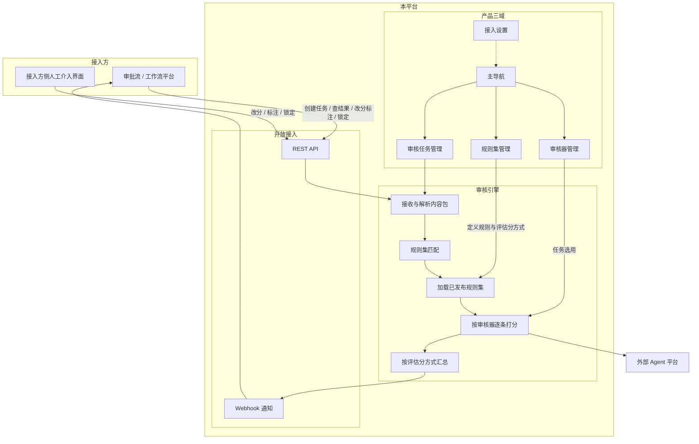
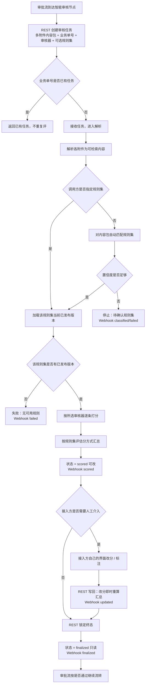
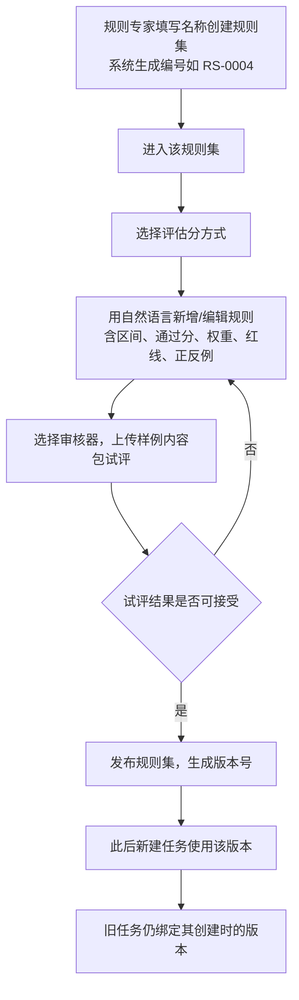
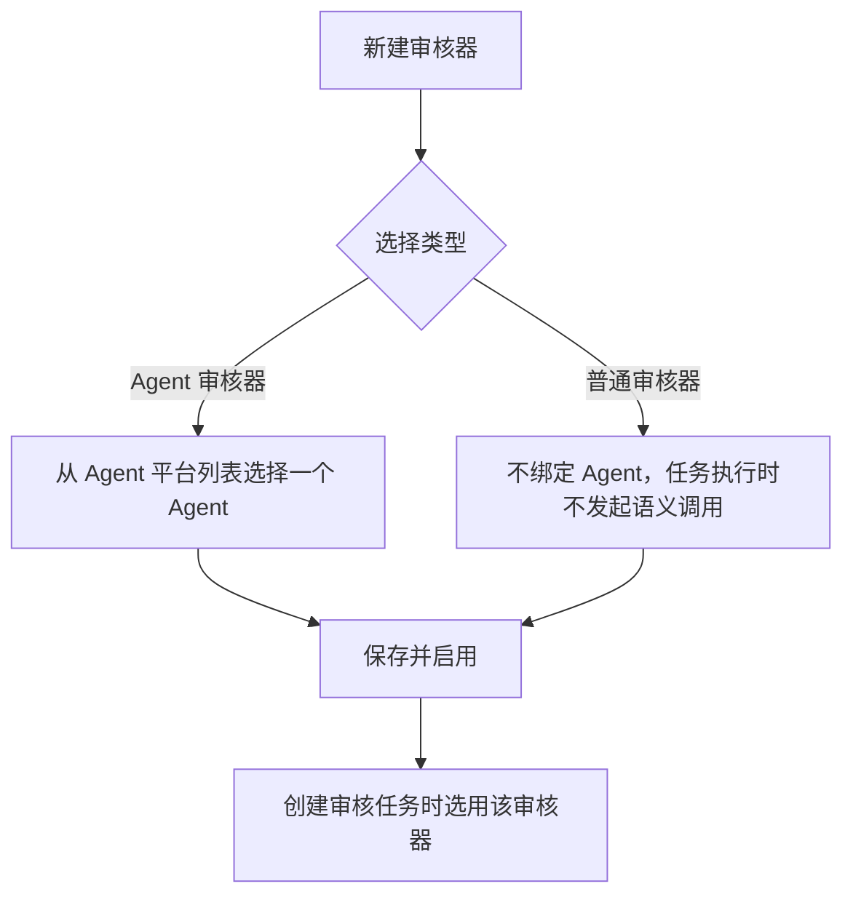
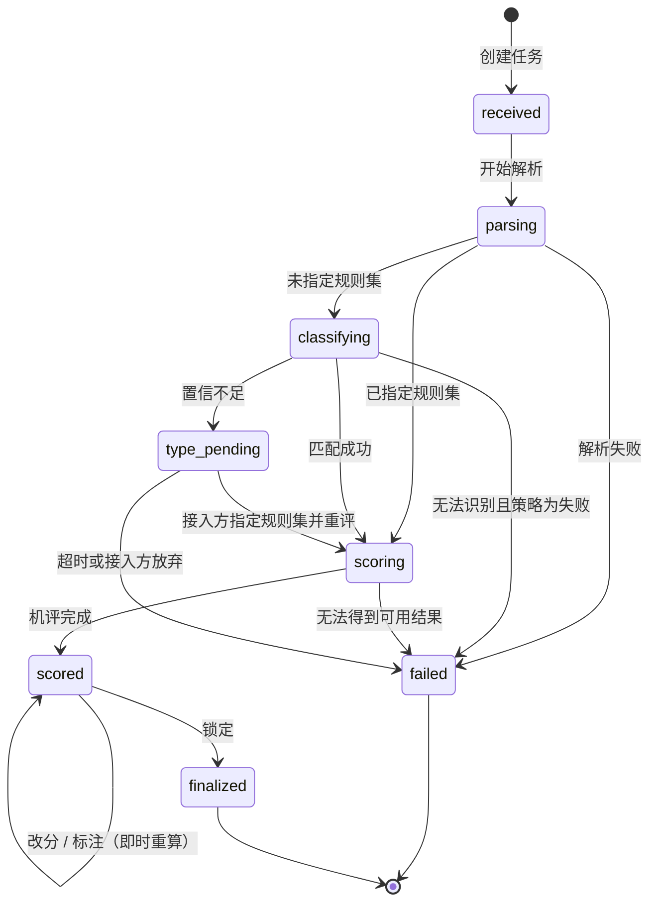
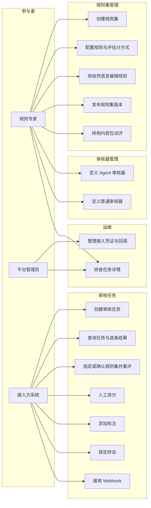

# 智能审核平台 产品需求文档（PRD）

| 项 | 内容 |
|---|---|
| 产品名称 | 智能审核平台 |
| 文档版本 | v0.2 |
| 日期 | 2026-08-30 |
| 状态 | 讨论稿，供评审 |
| 来源 | 产品讨论对齐结论；v0.2 将产品能力收口为规则集管理、审核器管理、审核任务管理 |

---

## 1. 产品/需求背景

审批流、工作流系统擅长「谁来批、批完去哪」，但不擅长「这份报告按业务标准该打多少分」。业务专家手里有大量用自然语言描述的质量标准（例如「风险披露是否充分」「结论是否有数据支撑」），这些标准难以写成传统 if/else 规则，却非常适合按条打分、给出依据。

当前常见做法是：人或临时脚本在流程节点里凭经验打分，标准不统一、不可复用、不可追溯，也难以被多个审批系统共用。

本产品要做的是一个**可被各类审批流/工作流对接的智能审核引擎**。产品能力按三个管理域展开：

1. **规则集管理**：定义「评什么」。用户创建规则集（只需填写名称，系统自动生成编号），再为该规则集编写具体规则，并配置评估分方式。
2. **审核器管理**：定义「怎么评」。用户创建审核器，跑任务时选用。支持 **Agent 审核器**（绑定 Agent 平台中的某个 Agent）与 **普通审核器**（不调用大模型）。
3. **审核任务管理**：定义「评哪一次」。一次任务绑定规则集版本与审核器，对多附件内容包逐条打分并汇总。

- 接入方把报告及附件提交进来；可指定规则集，未指定时由引擎自动匹配；按所选审核器逐条打分、按评估分方式汇总是否通过。
- Agent 审核器的判断能力来自外部 Agent 平台，本平台不自建 Agent 运行时。
- 必要时接入方可人工改分、加标注并锁定终态；人工怎么组织、谁来改，由接入方自己负责。

**面向用户：**

- 规则专家：配置规则集与评估分方式、试评、发布；定义审核器。
- 接入方系统：审批流 / 工作流 / 业务系统，通过 REST + Webhook 调用。
- 平台管理员：接入凭证、回调配置、任务排查。

---

## 2. 目标与范围

### 2.1 目标

1. 让业务专家能用自然语言维护可版本化的**规则集**，并为每套规则集配置**评估分方式**。
2. 让专家能定义可复用的**审核器**（Agent / 普通），跑任务时选用。
3. 让任意审批流以标准 REST + Webhook 接入，对「多附件内容包」做逐条打分与汇总。
4. 每次审核可解释、可复现、可人工介入（改分/标注）并留痕。
5. 本平台成为「审核大脑」，不替代工作流，不自建 Agent。

### 2.2 范围（本期 / MVP）

| 模块 | 本期包含 |
|---|---|
| 规则集管理 | 创建规则集（名称必填、编号系统生成）；在规则集下定义规则与评估分方式；版本发布、样例试评 |
| 审核器管理 | 定义 Agent 审核器（从 Agent 平台选择 Agent）与普通审核器；启用/停用；任务执行时选用 |
| 审核任务管理 | 创建任务（选择规则集 + 审核器）、列表与详情排查；指定规则集重评、改分/标注/锁定的演示入口 |
| 审核引擎 | 多附件内容包、指定规则集优先、未指定才自动匹配、按审核器逐条打分、证据回指文件位置、按评估分方式汇总 |
| 开放能力 | REST 创建/查询任务、改分、标注、锁定终态、指定规则集重评；Webhook 多事件；业务单号幂等 |
| 接入管理 | API 凭证、回调地址配置（入口放在头像/设置，不占主导航） |

### 2.3 不做什么

- 不做审批流本身：不排人、不转签、不催办、不待办中心、不组织架构。
- 不做给审批人用的复核工作台：人工介入由接入方在自己的界面完成，通过 API 写回。
- 不自建 Agent / 模型运行时；Agent 接口本期只保留适配边界，具体协议另定。
- 不做脚本规则、决策表、代码型规则引擎。
- 不做「每个附件各打一套分再汇总」；本期是整包一套规则、一套结果。
- 不做规则上的结构化「只评某类附件」（`applies_to`）；本期靠自然语言在标准里写明。
- 不做人评结果自动回流优化规则（可作后续）。

### 2.4 关键产品原则

1. **指定规则集是主路，自动匹配是兜底。** 未指定且匹配置信度不足时，不硬评。
2. **一次任务 = 一个内容包 + 一个审核器。** 可挂多个附件，规则默认作用在整个包上；审核器决定打分执行方式。
3. **逐条打分。** 每条规则独立出分，分数必须落在该规则定义的区间内。
4. **评估分方式由用户定义。** 规则集上选择评估分方式，不写死一种算法。
5. **机评与人评双轨。** 展示分优先用人分；改分后即时重算汇总；终态仅在锁定后不可改。
6. **规则必须版本化。** 历史任务绑定当时已发布版本，事后改规则不影响旧单。

---

## 3. 系统线框图（必选）

### 3.1 系统结构

平台面向规则专家的产品结构分三块：**规则集管理**、**审核器管理**、**审核任务管理**。评审引擎与开放接入在后台运行，不单独占主导航。外部审批流与 Agent 平台都在边界之外。



### 3.2 信息架构与页面骨架

Web 端，单栏业务后台。无移动端要求。接入设置放在头像菜单，不占主导航。

```
┌─────────────────────────────────────────────────────────┐
│  Logo  智能审核平台          设置     用户               │
├─────────────┬───────────────────────────────────────────┤
│ 工作台      │  主内容区                                 │
│ 规则集管理  │  列表 / 详情 / 编辑规则 / 评估分方式 / 试评 │
│ 审核器管理  │  Agent 审核器 / 普通审核器                 │
│ 审核任务管理│  创建任务 / 列表 / 详情排查                │
└─────────────┴───────────────────────────────────────────┘
```

| 页面 | 职责 | 对应功能 |
|---|---|---|
| 工作台 | 三域概览与演示路径 | — |
| 规则集列表 | 新建规则集（填名称，系统生成编号） | F1 |
| 规则集详情 | 该规则集的版本、发布状态 | F1、F2 |
| 规则集编辑 | 评估分方式、规则清单、发布 | F2、F3、F4 |
| 规则编辑 | 自然语言标准、分数契约、正反例 | F3 |
| 样例试评 | 选择审核器，上传样例内容包 | F5 |
| 审核器列表 | 新建/编辑 Agent 或普通审核器 | F26 |
| 审核任务列表 | 按单号/规则集/审核器/状态筛选 | F23 |
| 创建审核任务 | 选择规则集 + 审核器，提交内容包 | F13 |
| 任务详情 | 内容包、逐条结果、人改痕迹（排查用） | F24 |
| 接入设置 | 凭证、默认回调、事件订阅 | F21 |

规则专家主要使用「规则集 / 审核器 / 试评」；审核任务用于看试评和线上任务是否跑通，**不是**给审批人办公的复核台。

---

## 4. 业务流程图（必选）

### 4.1 主流程：接入方发起审核



**主路径：** 指定规则集 + 选择审核器 → 解析 → 逐条打分 → scored → 接入方直接锁定 → finalized。

**关键分支：**

- 未指定规则集且匹配不稳：不硬评，等接入方指定规则集后重评。
- Agent 审核器：按规则标准调用 Agent 平台中绑定的 Agent。
- 普通审核器：不调用大模型，按材料可解析性给出基线分，再按评估分方式汇总。
- 打分过程中单条规则失败：该条记失败，其他条继续；是否整单失败见功能需求 F11。
- 人工介入不是本平台状态机上的必经节点，由接入方决定是否调用改分/标注 API。

### 4.2 规则集配置与发布流程



### 4.3 审核器配置



### 4.4 审核任务状态



| 状态 | 含义 | 结果是否可用 | 是否可改分 |
|---|---|---|---|
| received / parsing / classifying / scoring | 进行中 | 否 | 否 |
| type_pending | 待确认规则集 | 否 | 否 |
| scored | 机评完成 | 是 | 是 |
| finalized | 已锁定 | 是（终态） | 否 |
| failed | 失败 | 否 | 否 |

说明：本平台**没有**「待复核」状态。要不要找人，是接入方的流程问题。

---

## 5. 用例图（必选）



**包含关系：**

- 「创建规则集」包含「填写名称」；编号由系统生成，用户不可改。
- 「配置规则」包含「选择评估分方式」「维护规则清单」。
- 「定义 Agent 审核器」包含「从 Agent 平台选择 Agent」。
- 「创建审核任务」包含「提交多附件内容包」「选择审核器」「可选指定规则集」。
- 「人工改分」包含「写改分原因」；改分后系统重算汇总。

**扩展关系：**

- 「创建审核任务」在未指定规则集时扩展「自动匹配规则集」。
- 「查询结果」在存在人改时扩展「查看机评/人评对照」。

本期无「审批人登录本平台复核」用例。

---

## 6. 用户与场景

### 6.1 角色

| 角色 | 说明 |
|---|---|
| 规则专家 | 业务侧定义「什么算一份合格报告」。创建规则集、用自然语言写规则、配置评估分方式、试评、发布；并定义审核器。不要求会写 Prompt 或代码。 |
| 接入方系统 | 审批流/工作流/业务系统。创建任务、拉结果、必要时代人写回改分与标注、锁定终态。 |
| 平台管理员 | 发凭证、配回调、查失败任务。 |
| 外部 Agent 平台 | 被调用的判断能力提供者，非本产品用户。 |

接入方侧的「审批人」不是本平台角色；他们只出现在接入方自己的界面里。

### 6.2 典型场景

**场景 A — 专家创建一套立项报告规则集**  
作为规则专家，我希望填写名称创建「立项报告规则集」（系统生成编号），再用白话写 10 条质量标准，每条设定 0–10 分和通过分 6，并选择「红线 + 加权」作为评估分方式，以便业务标准可复用、可发布。

**场景 A2 — 定义审核器**  
作为规则专家，我希望新建一个 Agent 审核器并绑定 Agent 平台中的「文档质量审核 Agent」，同时再备一个普通审核器用于无需语义理解的场景，以便跑任务时按场景选用。

**场景 B — 试评后再上线**  
作为规则专家，我希望选择审核器并上传 2～3 份历史报告（含附件）试评，看逐条分数和理由是否符合直觉，以便把含糊的标准改清楚再发布。

**场景 C — 审批流指定规则集送审**  
作为接入方，我在「立项审批」节点已经知道该用哪套规则，希望把正文 PDF + 测算表一次性提交，指定规则集编号并选择审核器，以便跳过匹配、直接按该规则集已发布版本逐条打分。

**场景 D — 未指定规则集的通用收件箱**  
作为接入方，我从邮件/收件箱收到材料、尚不确定该用哪套规则，希望不传规则集让引擎自动匹配；没把握时不要乱评，以便我补上规则集再评。

**场景 E — 机评直接作为节点结果**  
作为接入方，我收到 `evaluation.scored` 后认为无需人工，希望立即锁定并把是否通过用于通过/驳回。

**场景 F — 少数单需要人工介入**  
作为接入方，我发现总分贴线或某条红线未过，希望在自己的页面让人改某条分数、在原文位置留一句标注，再锁定，以便处理引擎搞不定的例外。

**场景 G — 审计追溯**  
作为规则专家或管理员，我希望打开某次任务，看到用的是规则集 v3、机评多少分、谁在何时改成多少、证据来自哪个附件哪一段，以便对得上历史结论。

---

## 7. 功能需求

优先级：P0 = MVP 必须；P1 = 同期尽量有，可略后；P2 = 明确不做或下一期。

### 7.1 领域对象（功能描述用）

**规则集**  
业务对一套审核标准的命名与容器，如「立项报告规则集」。创建时只需填写名称（及可选说明）；**编号由系统自动生成**（如 `RS-0004`），创建后不可改。调用方用编号指定规则集。同一规则集同时只应有一个「当前已发布」版本供新任务使用；历史版本只读保留。规则集上配置**评估分方式**与规则列表。

> 说明：规则集在产品语言上替代原「文档类型」。逻辑仍是「一类材料对应一套可版本化的标准」，表述改为审核域常用术语。

**规则集版本**  
一次发布形成的不可变快照：评估分方式、规则列表、版本号、状态（草稿/已发布/已停用）。

**规则**  
规则集中的一条可独立打分标准：

| 字段 | 说明 |
|---|---|
| 名称 | 列表展示用 |
| 评审标准 | 自然语言，可多段；专家只写人话，不写 Prompt |
| 最低分 / 最高分 | 评分区间，机评与人改都必须落在区间内 |
| 通过分 | 该条 ≥ 此分为通过 |
| 权重 | 加权类模式使用 |
| 是否红线 | 「红线 + 加权」模式下，红线条必须通过 |
| 正反例 | 可选。「这样算高分 / 这样算低分」的短示例 |

**审核器**  
任务执行时选用的打分执行器。两类：

| 类型 | 说明 |
|---|---|
| Agent 审核器 | 用户从 Agent 平台提供的可选 Agent 列表中选择一个进行绑定。任务执行时按规则标准调用该 Agent 逐条语义打分。 |
| 普通审核器 | 不绑定 Agent、不调用大模型。按材料可解析性给出基线分，再按规则集评估分方式汇总。 |

审核器可启用/停用。停用后不可被新任务选用。

**审核任务**  
一次对一个内容包的审核。必须指定审核器；规则集可指定或自动匹配。绑定创建时的规则集版本（发布后新任务用新版本，旧任务不迁移）。

**内容包 / 附件**  
任务下多个文件。每个附件含文件名、类型、可选 `role`（调用方自定义，如 `main` / `appendix` / `financial`）、顺序。本期规则不按 role 过滤，但 role 要存下来，证据和展示要用。

**逐条结果**  
每条规则一条：机评分、机评理由、证据列表（`file_id` + 位置 + 摘录）、人工分（可空）、改分原因、展示分、该条是否通过、该条标注。

**标注**  
两种：挂在某条规则结果上；挂在某个附件的某段位置上。用于人工意见，不替代改分。

### 7.2 评估分方式（用户可配）

规则集必须选择且仅选择一种评估分方式：

| 模式 | 规则 | 整单通过条件 |
|---|---|---|
| 全部通过 | 不考虑权重 | 每一条展示分 ≥ 该条通过分 |
| 加权总分 | 使用权重 | `Σ(展示分 × 权重)` 达到规则集上配置的总分通过线 |
| 红线 + 加权 | 红线条必须过，其余参与加权 | 所有红线条通过，且加权总分达到通过线 |

加权总分的计算口径（含是否把红线条计入加权）须在界面上写清，建议默认：**红线条不计入加权，只做一票否决；非红线条做加权。** 「全部通过」「加权总分」模式下「是否红线」可展示但无效果，避免专家困惑。

本期不做自定义公式、不做「通过条数比例」（P2）。

### 7.3 功能点列表

#### 模块 A：规则集管理

| 编号 | 功能点 | 说明 | 优先级 |
|---|---|---|---|
| F1 | 规则集主档 | 创建时只需名称（说明选填）；系统自动生成编号（如 `RS-0004`），编号创建后不可改；可编辑名称/说明、启用/停用；列表检索 | P0 |
| F2 | 规则集版本 | 草稿编辑；发布后生成不可变版本；可基于某版本另存为新草稿；停用后新任务不可用该规则集当前发布 | P0 |
| F3 | 自然语言规则编辑 | 维护规则字段见 7.1；保存时校验 min &lt; max、通过分落在区间内、加权模式下权重必填且 &gt; 0、红线+加权下至少一条红线 | P0 |
| F4 | 配置评估分方式 | 三种方式切换；加权类需配置总分通过线；切换时提示对权重/红线字段的影响 | P0 |
| F5 | 样例试评 | 在草稿或已发布版本上选择审核器、上传多附件试评；展示逐条分、理由、证据、汇总；试评不产生对外 Webhook，可记入任务列表并标记为「试评」 | P0 |
| F6 | 规则排序 | 清单可调整顺序，影响展示与试评列表顺序，不影响计分 | P1 |

#### 模块 B：审核器管理

| 编号 | 功能点 | 说明 | 优先级 |
|---|---|---|---|
| F26 | 定义审核器 | 创建/编辑/启用/停用。类型为 Agent 审核器或普通审核器。Agent 审核器必须从 Agent 平台可选列表中选择一个 Agent；普通审核器不绑定 Agent | P0 |
| F27 | 任务选用审核器 | 创建审核任务（含试评）必须选择一个已启用的审核器；查询结果展示所用审核器及绑定的 Agent（若有） | P0 |

#### 模块 C：审核引擎

| 编号 | 功能点 | 说明 | 优先级 |
|---|---|---|---|
| F7 | 内容包解析 | 支持常见报告格式（至少 PDF、Word）；多附件分别解析；单个附件解析失败时：该附件标记失败，其余继续；若全部失败则任务失败 | P0 |
| F8 | 指定规则集 / 自动匹配 | 请求带规则集编号则跳过匹配；未带则匹配并给出规则集、置信度、依据。低于阈值 → `type_pending`（待确认规则集），不打分 | P0 |
| F9 | 逐条打分 | 按所选审核器对规则集每条规则独立打分。Agent 审核器调用绑定 Agent；普通审核器按可解析性给基线分。默认从全部附件检索相关内容；分数强制夹在区间内；Agent 路径必须返回理由 + 至少尝试给出证据（证据对不上原文位置时可仅有摘录、标记「位置未定位」） | P0 |
| F10 | 按评估分方式汇总 | 用展示分按 7.2 计算总分与整单是否通过；任何一条展示分变化后立即重算 | P0 |
| F11 | 单条打分失败策略 | 单条超时或 Agent 失败：该条状态=失败、无展示分；「全部通过」或该条为红线时整单不得判通过；其余方式可出部分汇总但整单状态仍为 scored，并标明不完整。全部规则失败则任务 failed | P0 |
| F12 | 绑定规则版本 | 任务创建（或开始评分）时冻结规则集版本；试评绑定当前正在编辑的草稿内容快照 | P0 |

引擎通过「一条规则一次判断」调用外部 Agent（仅 Agent 审核器）：输入为规则标准、分数区间、内容切片；输出为分数、理由、证据。具体 Agent 协议本期不展开，但产品要求：**专家界面永不暴露 Prompt。** Agent 列表来自 Agent 平台，本平台只做选择与绑定。

#### 模块 D：开放 API 与 Webhook

以下为产品能力，路径名为示意，技术方案可调整，语义不可偏。

| 编号 | 功能点 | 说明 | 优先级 |
|---|---|---|---|
| F13 | 创建审核任务 | 提交多附件（文件或可访问 URL）、业务单号、**审核器 ID**、可选规则集编号、回调 URL、附件 `role`/`sort`。立即返回任务 ID；异步执行 | P0 |
| F14 | 幂等 | 同一接入方 + 同一业务单号重复创建，返回原任务，不新开一轮打分。若需重评应走明确的重评/改规则集接口 | P0 |
| F15 | 查询任务 | 返回状态、规则集来源（specified / classified）、规则集版本、审核器、附件列表、逐条结果、汇总、是否锁定、时间戳 | P0 |
| F16 | 人工改分 | 在 scored 下修改某条人工分（必须落在区间内）+ 改分原因；机评分不变；展示分改为人分；即时重算；发 `updated` | P0 |
| F17 | 标注 | 对规则结果或附件位置新增标注；不改变分数；发 `updated` | P0 |
| F18 | 锁定终态 | scored → finalized；此后改分/标注/重评拒绝；发 `finalized` | P0 |
| F19 | 指定规则集并重评 | 用于 `type_pending` 或调用方认为规则集错了（仅 scored 且未锁定）。重评覆盖机评结果，清除人工分（需在响应中明示） | P0 |
| F20 | Webhook 事件 | 见 7.4；至少支持订阅；失败重试的策略由技术方案定，产品要求：关键事件至少投递到成功或可查的死信/失败记录 | P0 |
| F21 | 接入凭证 | 按接入方颁发凭证，请求需鉴权；可禁用凭证 | P0 |
| F22 | 撤销终态 | 一般不允许。若业务强需求，列为 P2，需单独审计事件 | P2 |

#### 模块 E：审核任务管理（排查，非复核台）

| 编号 | 功能点 | 说明 | 优先级 |
|---|---|---|---|
| F23 | 任务列表 | 按业务单号、规则集、审核器、状态、时间筛选；区分「审核任务」与「试评」 | P0 |
| F24 | 任务详情 | 附件列表可打开/下载（权限内）；逐条机评/人评对照；所用审核器；证据跳到对应附件摘录；操作时间线 | P0 |
| F25 | 后台改分 | 管理员或专家在后台直接改分。**本期不做**，避免与「介入在接入方」冲突；后台只读 | P0（明确不做） |

### 7.4 Webhook 事件

| 事件 | 何时 | 接入方典型动作 |
|---|---|---|
| `evaluation.classified` | 自动匹配得出规则集（含 type_pending 时也应告知候选） | 确认或改规则集 |
| `evaluation.scored` | 机评完成，结果可用、可改 | 展示初评或直接锁定 |
| `evaluation.updated` | 改分或新增标注 | 刷新节点展示 |
| `evaluation.finalized` | 已锁定 | 按是否通过流转 |
| `evaluation.failed` | 解析失败、无规则、整单无法评分等 | 失败分支 / 人工 |

接入方最少订阅 `scored` / `finalized` / `failed` 即可完成审批节点对接。

事件载荷（产品级，字段名可在技术方案微调）应包含：任务 ID、业务单号、状态、规则集、审核器、规则集版本、汇总（评估分方式、总分、是否通过、是否完整）、时间。`scored` / `updated` / `finalized` 可带逐条摘要（规则名、展示分、是否通过）；完整明细以查询接口为准。

### 7.5 创建任务时内容包约定

- 至少 1 个附件；上限本期建议产品层给出可配置默认（如 20 个文件、单文件数十 MB 级），超限明确报错。
- 每个附件可带 `role`、`sort`；不传则按提交顺序。
- 规则默认评整个内容包，不按附件拆多套分数。
- 证据必须带 `file_id`，能区分「这句话来自哪个文件」。

### 7.6 结果对象（查询接口应能还原）

一次任务对外至少能还原：

- 任务状态、是否锁定  
- 规则集及来源（specified / classified + 置信度/依据）  
- 规则集版本 ID  
- 审核器 ID / 类型 / 绑定 Agent（若有）  
- 全部附件元数据  
- 逐条：机评分、人工分、展示分、该条是否通过、理由、证据、标注、该条是否机评失败  
- 汇总：评估分方式、总分（若适用）、整单是否通过、结果是否完整  
- 操作时间线：创建、识别、机评完成、每次改分/标注、锁定  

---

## 8. 原型图/界面说明（必选）

本期界面只服务规则专家与管理员。接入方界面不在范围内。Web 桌面宽度。

### 8.1 规则集列表

对应 F1。

```
┌──────────────────────────────────────────────────────────────┐
│ 规则集管理                            [+ 新建规则集]          │
│ 创建时只需名称；编号由系统生成。                               │
├────────────┬──────────────┬──────────┬──────────┬────────────┤
│ 编号       │ 名称         │ 当前版本 │ 状态     │ 操作       │
│ RS-0001    │ 立项报告规则集│ v3 已发布│ 启用     │ 定义规则   │
│ RS-0002    │ 季度工作报告  │ 无发布   │ 启用     │ 定义规则   │
└────────────┴──────────────┴──────────┴──────────┴────────────┘
空态：尚无规则集。主按钮「新建规则集」。
```

新建：名称、说明。编号创建后由系统生成（如 RS-0004），界面只读展示。

### 8.1b 审核器列表

对应 F26。

```
┌──────────────────────────────────────────────────────────────┐
│ 审核器管理                            [+ 新建审核器]          │
├──────────────┬────────────┬──────────────────┬──────┬────────┤
│ 名称         │ 类型       │ 绑定 Agent       │ 启用 │ 操作   │
│ 立项质量审核器│ Agent     │ 文档质量审核 Agent│ 是   │ 编辑   │
│ 结构化基线审核器│ 普通     │ —                │ 是   │ 编辑   │
└──────────────┴────────────┴──────────────────┴──────┴────────┘
新建 Agent 审核器：名称 + 从 Agent 平台列表选择 Agent。
新建普通审核器：名称 + 说明；不绑定 Agent。
```

### 8.2 规则集编辑（核心页）

对应 F2、F3、F4、F5。

```
┌──────────────────────────────────────────────────────────────┐
│ 立项报告规则集 / 草稿                    状态：草稿           │
│ 基于已发布 v3 另存                          [试评] [发布]    │
├──────────────────────────────────────────────────────────────┤
│ 评估分方式  ( ) 全部通过  (•) 红线+加权  ( ) 加权总分        │
│ 总分通过线  [ 70 ]     说明：红线条一票否决，其余加权         │
├────┬────────────┬──────┬──────┬──────┬────┬──────┬───────────┤
│ 序 │ 名称       │ 区间 │ 通过 │ 权重 │红线│ 状态 │ 操作      │
│ 1  │ 风险披露   │ 0-10 │  6   │  2   │ 是 │ 完整 │ 编辑 上移 │
│ 2  │ 数据支撑   │ 0-10 │  6   │  3   │ 否 │ 完整 │ 编辑      │
│ 3  │ 结论清晰度 │ 0-5  │  3   │  1   │ 否 │ 缺正反例│ 编辑   │
│                              [+ 添加规则]                    │
├──────────────────────────────────────────────────────────────┤
│ 未发布提示：线上任务仍使用 v3；发布后新任务使用本草稿。       │
└──────────────────────────────────────────────────────────────┘
```

**校验与状态：**

- 发布前：至少一条规则；评估分方式字段合法；加权类权重齐全。
- 发布确认框：展示将生成的版本号，并提示「进行中的旧任务不受影响」。
- 已发布版本页只读，提供「复制为新草稿」。

### 8.3 规则编辑

对应 F3。

```
┌──────────────────────────────────────────────────────────────┐
│ 编辑规则 · 风险披露                              [保存] [取消]│
│ 名称    [风险披露是否充分                              ]     │
│ 评审标准（写给人看的标准，不用写提示词）                      │
│ ┌──────────────────────────────────────────────────────────┐ │
│ │ 评估报告是否充分披露市场、技术、财务与合规风险。         │ │
│ │ 有风险识别、影响分析与应对措施的给高分；只罗列标题     │ │
│ │ 或回避重大风险的给低分。                               │ │
│ └──────────────────────────────────────────────────────────┘ │
│ 最低分 [0]  最高分 [10]  通过分 [6]  权重 [2]  红线 [x]      │
│ 正例（什么样算高分，选填）                                    │
│ 反例（什么样算低分，选填）                                    │
│ 保存失败：通过分须在最低分与最高分之间。                      │
└──────────────────────────────────────────────────────────────┘
```

专家侧不出现模型名、Prompt、温度等技术字段。

### 8.4 样例试评

对应 F5。

```
┌──────────────────────────────────────────────────────────────┐
│ 试评 · 立项报告规则集 · 当前草稿                               │
│ 审核器：[立项质量审核器 ▼]                                     │
│ 添加文件：[正文.pdf] [测算.xlsx]  role: main / financial      │
│                                         [开始试评]            │
├──────────────────────────────┬───────────────────────────────┤
│ 内容包                       │ 结果                          │
│ · 正文.pdf                   │ 评估分方式：红线+加权  总分 72  不通过│
│   摘录高亮：第 12 页…        │ 风险披露  4/10  未通过 红线    │
│ · 测算.xlsx                  │   理由：仅列风险标题，无应对   │
│                              │   证据：正文.pdf p.12 「…」   │
│ 试评中：逐条进度 3/10        │ 数据支撑  8/10  通过           │
│ 失败：测算.xlsx 无法解析，   │ …                             │
│ 已用其余文件继续             │                               │
└──────────────────────────────┴───────────────────────────────┘
```

空态：尚未上传文件。错误态：格式不支持、文件过大。试评任务出现在任务列表，标记「试评」，无 Webhook。

### 8.5 任务列表与详情（排查）

对应 F23、F24。只读。

**列表：** 业务单号、规则集、审核器、来源（指定/自动匹配）、状态、是否通过、是否完整、创建时间、试评标记。

**详情：**

```
┌──────────────────────────────────────────────────────────────┐
│ 任务 EVL-20260830-001     业务单号 APP-8891                  │
│ 状态 scored · 规则集 立项报告规则集 RS-0001（指定）· v3      │
│ 审核器：立项质量审核器（Agent · 文档质量审核 Agent）          │
│ 汇总：红线+加权  72分  不通过  完整                           │
├─────────────┬────────────────────────────────────────────────┤
│ 附件        │ 逐条结果                                       │
│ 正文.pdf    │ 风险披露  机评4  人评6  展示6  通过            │
│ 测算.xlsx   │  改分原因：补充了附件中的应对措施               │
│             │  机评理由 / 证据（可切到附件摘录）              │
│             │ 标注：…                                        │
├─────────────┴────────────────────────────────────────────────┤
│ 时间线：创建 → 解析完成 → 机评完成 → 改分 → …                │
│ 本页不可改分。人工介入请走接入方 API。                        │
└──────────────────────────────────────────────────────────────┘
```

### 8.6 接入设置

对应 F21、F20。

- 生成/停用凭证（密钥只显示一次）。
- 默认回调 URL；可勾选订阅事件。
- 投递失败记录入口（P1 可简：任务详情中展示最近投递状态）。

### 8.7 核心操作串联

1. 新建规则集（填名称，系统生成编号）→ 定义规则与评估分方式 → 试评 → 发布。  
2. 新建 Agent 审核器（选择 Agent 平台中的 Agent）或普通审核器。  
3. 创建审核任务（指定规则集 + 审核器）→ 任务详情可见 scored。  
4. 接入方改分 → 详情时间线出现人评对照 → 锁定后状态 finalized，字段只读。

### 8.8 关键状态一览

| 状态 | 界面表现 |
|---|---|
| 空态 | 规则集/审核器/任务列表均有一句说明 + 主操作按钮 |
| 校验失败 | 字段旁红字，发布按钮不可用并列出缺失项 |
| 试评/机评中 | 进度（已完成规则数/总数），禁止重复点「开始」 |
| type_pending | 任务详情明确「等待指定规则集」，不展示假分数 |
| 部分失败 | 汇总旁标签「不完整」，失败规则行标记失败原因 |
| 已锁定 | 全局只读徽章 |
| Webhook 失败 | 任务详情提示「通知接入方失败」，不影响已算出的分 |

---

## 9. 非功能需求

| 类别 | 要求 |
|---|---|
| 可解释 | 每条成功机评必须有理由；证据尽量带回文件与位置；无位置时显式降级 |
| 可复现 | 任务绑定规则集版本；查询能还原当时规则与分数 |
| 审计 | 创建、识别、机评、改分、标注、锁定均留操作者（系统/凭证身份）、时间、前后值 |
| 幂等与安全 | 创建任务幂等；开放接口鉴权；附件仅任务相关方可访问；密钥不落日志 |
| 异步 | 文档评审默认异步；创建接口快速返回；耗时在产品上不承诺固定秒数，但状态可轮询、可 webhook |
| 可靠 | Webhook 需重试；最终失败可查 |
| 多附件 | 内容包是一等公民；证据必须能区分文件 |
| 多端 | 本期仅 Web 管理端 + REST；无移动端 |
| Agent 边界 | 引擎不依赖某一家 Agent 的专有概念；失败时任务/单条状态可理解，不把底层堆栈抛给接入方 |
| 语言 | 产品界面与规则编辑默认中文 |

性能指标（供技术方案参考，非拍脑袋 SLA）：单任务规则条数建议产品提示「建议不超过 50 条」；超出可评但需提示耗时增加。具体并发与时延由技术方案评估。

---

## 10. 与现有功能的关系

本项目为全新产品，仓库内尚无业务功能。无迁移、无兼容旧数据。

与外部系统关系：

- **审批流 / 工作流：** 调用方，本产品不嵌入其流程引擎。
- **Agent 平台：** 被调用方，接口细节不在本 PRD 展开，但必须可替换。

---

## 11. 验收标准

### 11.1 MVP 完成标准

1. 规则专家可完成：建规则集（名称 + 系统编号）→ 用自然语言配规则（含区间、通过分、三种评估分方式之一）→ 定义审核器 → 多附件试评 → 发布版本。  
2. 接入方可完成：REST 提交多附件任务（指定规则集 + 审核器）→ 收到 `scored` → 查询到逐条分、理由、带 file_id 的证据、按评估分方式汇总。  
3. 不指定规则集时：高置信度自动进入评分；低置信度进入 `type_pending` 且不打分；指定规则集后可重评。  
4. 同一业务单号重复创建不产生第二次打分。  
5. scored 下改分（区间校验 + 原因）后汇总立即变化，并 `updated`；锁定后不可改，并 `finalized`。  
6. 历史任务仍展示发布时的规则版本，不受后续发布影响。  
7. 后台能只读看到任务详情、所用审核器与人改痕迹；后台不能改分。  
8. 专家界面无 Prompt/模型配置；Agent 审核器仅选择 Agent 平台中的 Agent；失败对接入方为明确业务错误而非堆栈。

### 11.2 建议的验收用例

| 用例 | 期望 |
|---|---|
| 指定规则集 + Agent 审核器 + 2 个附件 + 「全部通过」 | 每条都有分；有一条低于通过分则整单不通过 |
| 「红线 + 加权」红线条未过 | 整单不通过，即使加权分很高 |
| 未传规则集且匹配不准 | type_pending，无假分，可补规则集重评 |
| 普通审核器 | 不调用 Agent，仍按评估分方式汇总 |
| 改一条分跨越通过线 | 即时改变该条与整单通过状态 |
| finalize 后再改分 | 拒绝 |
| 试评 | 有逐条结果，无对外 webhook |
| 发布 v4 后查 v3 旧任务 | 仍按 v3 展示 |

---

## 12. 默认方案与待技术方案确认项

以下已作为产品默认，无需再开产品讨论；若实现约束要改，在技术方案里说明。

| 项 | 默认 |
|---|---|
| 多附件 | 整包一套分，不按文件出多套结果 |
| 附件 role | 只存储与展示，本期不参与规则匹配 |
| 人工介入 | 仅 API；无复核台、无后台改分 |
| 改分 | 即时重算；终态靠 finalize 锁定 |
| 红线 + 加权 | 红线一票否决，不计入加权 |
| 识别不准 | 不硬评 |
| Agent | 外呼，本 PRD 不定义报文 |

技术方案阶段建议优先澄清（不阻塞本 PRD 评审）：文件大小与页数上限、解析格式清单、识别阈值如何配置、单条失败重试次数、Webhook 签名与重试、多租户是否第一期就要。

---

## 附录 A：术语

| 术语 | 含义 |
|---|---|
| 内容包 | 一次任务下的全部附件集合 |
| 展示分 | 有人工分则用人分，否则用机评分 |
| 通过模式 | 规则集上定义的整单通过算法（产品界面称「评估分方式」） |
| 审核器 | 任务执行时选用的打分执行器：Agent 审核器或普通审核器 |
| 规则集编号 | 系统生成的规则集标识，如 RS-0001 |
| 红线 | 该条必须通过，否则整单不通过（仅在对应模式下生效） |
| 试评 | 规则专家用样例内容包验证规则，不通知接入方 |
| 锁定 / finalize | 结果变为只读终态 |

---

## 附录 B：与讨论结论的对应

| 讨论结论 | 落点 |
|---|---|
| 更偏报告/文档质量评审 | 全文以文档内容包为主对象 |
| 业务专家用自然语言配 | F3，界面不暴露 Prompt |
| 通过标准用户定义、多种模式 | 7.2 三种评估分方式 |
| 调用方可指定规则集，不指定才匹配 | F8，指定为主路 |
| 人可加标注、改分 | F16、F17；流程在接入方 |
| 标准 REST + Webhook | 模块 D |
| 一份任务可挂多附件 | 7.5，整包评审 |
| 改分即时重算、finalize 锁定 | F10、F18 |
| 不管复核工作台 | 不做什么、F25、无审批人角色 |
| 产品分三域 | 规则集管理、审核器管理、审核任务管理；v0.2 |
| Agent 审核器可选 Agent 列表来自 Agent 平台 | F26 |
