# 智能审核平台 技术方案

| 项 | 内容 |
|---|---|
| 产品 | 智能审核平台 |
| 对应 PRD | `doc/产品方案/2026-08-30_智能审核平台-PRD.md`（v0.2） |
| 文档版本 | v1.0 |
| 日期 | 2026-08-30 |
| 代码分支 | `feature-20260830-intelligent-audit-platform` |
| 工程 | Maven 多模块，`groupId=com.audit.platform`，建议 `artifactId=audit-platform` |

---

## 1. 目标与范围

### 1.1 要解决的问题

建设可被审批流对接的智能审核引擎：规则专家维护**规则集**与**审核器**；接入方提交多附件内容包，按所选审核器逐条打分，按评估分方式汇总；结果可查询、可改分/标注、可锁定；通过 REST + Webhook 回传。

### 1.2 范围

本期一份方案覆盖 PRD MVP 全部功能：规则集管理、审核器管理、审核任务管理（含引擎）、开放 API、Webhook、管理端查询/配置接口及管理端 Web 部署。

**不包含：** 审批流本身、复核台、自建 Agent 运行时、多租户、脚本规则引擎、按附件拆多套分数。

### 1.3 设计前共识（已确认）

| 项 | 结论 |
|---|---|
| 部署架构 | **重新设计**（新产品，无既有部署可复用） |
| 技术栈 | Java 六层 Maven + 本期设计管理端 Web 接口与部署 |
| 方案切分 | **一份方案覆盖整个 MVP** |
| 包前缀 | `com.audit.platform` |
| 异步打分 | **应用内线程池**，本期不上 MQ 产品 |
| 附件存储 | **对象存储 TOS**（S3 兼容），库中只存对象键与元数据 |
| 鉴权 | 开放 API：**API Key**；管理端：**SSO**（方案留对接点） |
| 租户 | **单租户**，表不带 `tenant_id` |
| Agent | 领域网关 + **Mock 适配器**可跑通，真实平台可替换 |
| 写接口 | 对外也统一 **POST 命令**（不用 PUT/PATCH/DELETE） |
| Webhook | **独立投递队列** + 指数退避 + 失败可查/死信（用 Redis 延迟队列实现，不引入 MQ） |
| 性能 | 按生产设计；具体数字采用下文「生产基线假设」，上线前按压测可调 |

### 1.4 生产基线假设（待压测确认）

| 指标 | 假设 |
|---|---|
| 创建任务（开放 API） | P99 &lt; 300ms（只落库并投递异步打分） |
| 管理端列表 | P99 &lt; 500ms |
| 单任务规则数 | 产品提示 ≤ 50 条；超限可评但需提示耗时 |
| 单任务机评完成 | 典型 &lt; 3 分钟（受 Agent 超时约束，单条超时可配置） |
| 单实例在途任务 | 50；prod 2 实例约 100 |
| Webhook | 重试后投递成功率目标 99.9%；失败进死信可查可重放 |

### 1.5 命令 / 查询归属（已从 PRD 判定，无需再确认）

| 类型 | 用例 |
|---|---|
| 命令 | 创建/编辑/启停规则集；草稿规则维护；发布；创建/编辑/启停审核器；创建任务；改分；标注；锁定；指定规则集重评；发凭证；保存回调配置；同步 Agent 目录；重放 Webhook |
| 查询 | 规则集/版本/规则列表与详情；审核器列表；Agent 目录；任务列表与详情；凭证列表；Webhook 投递记录 |

---

## 2. 架构设计

### 2.1 应用架构

新品，仓库内无 Java 业务代码。后端按六层新建；管理端为独立 SPA，只调 HTTP。

#### 2.1.1 分层依赖

```text
adapter → application → client
application → domain
application → infra（仅 QueryService 注入 Mapper；禁止注入 Repository/Gateway）
infra → domain
domain → facade
adapter → client
```

Spring Bean 一律 `@Resource` 字段注入。

#### 2.1.2 代码结构

| 层 | 领域 | 包 | 职责 |
|---|---|---|---|
| facade | common | `com.audit.platform.facade.domain` | 领域基类、审计字段约定 |
| facade | common | `com.audit.platform.facade.event` | `DomainEventDTO`、`DomainEventPublisher` |
| facade | common | `com.audit.platform.facade.result` | 统一 `Result`、分页 |
| client | ruleset | `com.audit.platform.client.ruleset` | 规则集 ParamDTO / DTO |
| client | auditor | `com.audit.platform.client.auditor` | 审核器 ParamDTO / DTO |
| client | evaluation | `com.audit.platform.client.evaluation` | 任务 ParamDTO / DTO |
| client | access | `com.audit.platform.client.access` | 凭证、接入设置、Webhook 日志 DTO |
| domain | ruleset | `com.audit.platform.domain.ruleset` | 规则集聚合、工厂、仓储、网关、事件 |
| domain | auditor | `com.audit.platform.domain.auditor` | 审核器聚合、Agent 目录同步动作 |
| domain | evaluation | `com.audit.platform.domain.evaluation` | 审核任务聚合、打分/改分/锁定 |
| domain | access | `com.audit.platform.domain.access` | API 凭证、接入设置 |
| infra | ruleset | `com.audit.platform.infra.ruleset` | Entity/Mapper/RepositoryImpl/FactoryImpl/GatewayImpl |
| infra | auditor | `com.audit.platform.infra.auditor` | 同上；Agent 平台 Mock 客户端 |
| infra | evaluation | `com.audit.platform.infra.evaluation` | 同上；TOS、解析、线程池打分、Webhook HTTP |
| infra | access | `com.audit.platform.infra.access` | 凭证哈希、Webhook 队列 |
| infra | common | `com.audit.platform.infra.common` | 事件发布、Redisson 锁、异常 |
| application | ruleset | `com.audit.platform.application.ruleset` | RuleSetCommandService / RuleSetQueryService |
| application | auditor | `com.audit.platform.application.auditor` | AuditorCommandService / AuditorQueryService |
| application | evaluation | `com.audit.platform.application.evaluation` | EvaluationCommandService / EvaluationQueryService |
| application | access | `com.audit.platform.application.access` | AccessCommandService / AccessQueryService |
| adapter | ruleset | `com.audit.platform.adapter.rest.admin.ruleset` | 管理端规则集 Command/Query Controller |
| adapter | auditor | `com.audit.platform.adapter.rest.admin.auditor` | 管理端审核器 Controller |
| adapter | evaluation | `com.audit.platform.adapter.rest.admin.evaluation` | 管理端任务排查 Controller |
| adapter | evaluation | `com.audit.platform.adapter.rest.open.evaluation` | 开放 API 任务 Command/Query Controller |
| adapter | access | `com.audit.platform.adapter.rest.admin.access` | 凭证与回调设置 |
| adapter | evaluation | `com.audit.platform.adapter.scheduler.evaluation` | Webhook 投递扫描、死信告警 |
| adapter | auditor | `com.audit.platform.adapter.scheduler.auditor` | Agent 目录同步（可选） |
| adapter | evaluation | `com.audit.platform.adapter.listener.evaluation` | 领域事件 → 入队 Webhook / 触发异步打分 |
| adapter | common | `com.audit.platform.adapter.config` | SSO 过滤器、API Key 过滤器、线程池、CORS |

#### 2.1.3 模块调用关系

**命令类（HTTP 管理端 / 开放 API）：**

```text
CommandController → CommandService
  →（校验）QueryService
  → Factory.create / createByNum
  → 领域动作（内部 Repository.save / Gateway / DomainEventPublisher）
  → 返回 num 或 DTO 标识
```

**命令类（异步打分）：**

```text
EvaluationCreated 事件监听器 → EvaluationCommandService.runPipeline(num)
  → Factory.createByNum → parse / classify / score 领域动作
```

**命令类（Webhook）：**

```text
领域事件监听器 → AccessCommandService.enqueueWebhook
定时任务 WebhookDispatchJob → AccessCommandService.dispatchDue
```

**查询类：**

```text
QueryController → QueryService → Mapper（LambdaQueryWrapper）→ DTO
```

#### 2.1.4 同步 / 异步边界

| 场景 | 同步/异步 | 触发 | 消费 | 说明 |
|---|---|---|---|---|
| 创建规则集/审核器/凭证 | 同步 | CommandController | CommandService | 立即返回编号 |
| 创建审核任务 | 同步落库 + 异步打分 | Open/Admin Command | Listener + 线程池 | 创建接口不跑机评 |
| 逐条打分 | 异步 | `EvaluationReceivedEvent` | `EvaluationPipelineListener` | `@Async` 线程池 |
| 改分/标注/锁定 | 同步 | CommandController | CommandService | 即时重算；再发 updated/finalized |
| Webhook HTTP | 异步 | 领域事件 | Redis 延迟队列 + 定时扫描 | 与打分线程池隔离 |
| 管理端/开放查询 | 同步 | QueryController | QueryService | 只读 |

创建任务后**不得**在 HTTP 线程内调用 Agent。流水线失败写 `failed`，不抛给调用方堆栈。

#### 2.1.5 与现有代码关系

无既有 Java 模块。`doc/ui/2026-08-30_智能审核平台/web` 仅作交互对照，**不作为后端实现**。管理端可按同一信息架构重接真实 API。

---

### 2.2 部署架构

新产品，重新设计应用/前端运行拓扑。数据库、Redis、TOS 使用云服务，不设计其底层集群。

#### 2.2.1 运行拓扑

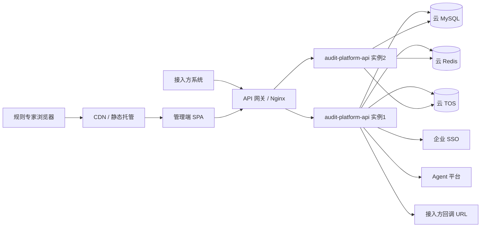
```mermaid
flowchart LR
  Expert[规则专家浏览器] --> CDN[CDN / 静态托管]
  CDN --> AdminWeb[管理端 SPA]
  Integrator[接入方系统] --> GW[API 网关 / Nginx]
  AdminWeb --> GW
  GW --> App1[audit-platform-api 实例1]
  GW --> App2[audit-platform-api 实例2]
  App1 --> MySQL[(云 MySQL)]
  App2 --> MySQL
  App1 --> Redis[(云 Redis)]
  App2 --> Redis
  App1 --> TOS[(云 TOS)]
  App2 --> TOS
  App1 --> SSO[企业 SSO]
  App1 --> Agent[Agent 平台]
  App1 --> CB[接入方回调 URL]
```

prod 两实例；线程池打分与 Webhook 扫描在**每个实例**上运行。任务认领用 Redis 锁（`eval:pipeline:{num}`），避免双实例重复打分。Webhook 投递用 `webhook:dispatch:{num}` 锁。

#### 2.2.2 实例清单

| 应用 | 类型 | 部署方式 | 实例数 | 访问入口 | 是否新增 |
|---|---|---|---|---|---|
| audit-platform-api | 后端 Spring Boot | 容器 / 云主机，前置网关 | prod **2**（可水平扩）；test 1；dev 1 | `/admin/v1/**`、`/open/v1/**` | 是 |
| audit-platform-admin | 管理端 SPA | TOS + CDN | **1** 套静态资源 | `https://audit-admin.{env}.example` | 是 |

无独立 Worker 进程：打分与 Webhook 均在 api 进程内。若后续在途任务超过单进程容量，再拆 Worker，不在本期部署。

#### 2.2.3 环境差异

| 项 | dev | test | prod |
|---|---|---|---|
| api 实例 | 1 | 1 | 2 |
| 域名 | localhost / 内网 | test 网关 | 正式网关 |
| SSO | Mock 头 / 开发回调 | 测试 SSO | 生产 SSO |
| Agent | MockGateway | Mock 或测试 Agent | 可替换真实适配器 |
| TOS bucket | `audit-dev` | `audit-test` | `audit-prod` |
| Webhook 真实外呼 | 默认关，可配白名单 | 开 | 开 |
| 线程池 | 小（core=2） | 中（core=4） | 大（core=8，max=16） |

#### 2.2.4 云服务依赖（只说明连接关系）

| 云服务 | 用途 | 连接方 | 失败策略 |
|---|---|---|---|
| 云 MySQL | 业务表 | api | 连接池；写失败回滚；读失败返回 5xx |
| 云 Redis | 分布式锁、Webhook 延迟队列、幂等 | api | 锁失败快速返回冲突；队列失败记表补偿 |
| 云 TOS | 附件原文 | api | 上传失败任务不可创建；下载/解析失败见领域规则 |
| 企业 SSO | 管理端登录 | 网关 + api 校验 token | token 无效 401 |
| Agent 平台 | Agent 审核器逐条判断 | api GatewayImpl | 单条超时失败；全部失败则任务 failed |
| 接入方 HTTP | Webhook | api | 指数退避；入死信；不影响已算出的分 |

#### 2.2.5 配置项（敏感值不写真实内容）

| 配置项 | 环境 | 说明 | 敏感 |
|---|---|---|---|
| `server.port` | all | 默认 8080 | 否 |
| `spring.datasource.*` | all | 云 MySQL | 是 |
| `spring.data.redis.*` | all | 云 Redis | 是 |
| `audit.tos.endpoint/bucket/ak/sk` | all | 对象存储 | 是 |
| `audit.sso.issuer` / `jwk-set-uri` | test/prod | 管理端 SSO | 否/视密钥 |
| `audit.openapi.key-header` | all | 默认 `X-Api-Key` | 否 |
| `audit.pipeline.core-size` / `max-size` / `queue-capacity` | all | 打分线程池 | 否 |
| `audit.agent.base-url` / `timeout-ms` | all | Agent 适配；Mock 可空 | 是 |
| `audit.agent.mock-enabled` | all | true 时走 MockGateway | 否 |
| `audit.parse.max-file-mb` / `max-files` | all | 默认 50MB / 20 个 | 否 |
| `audit.classify.threshold` | all | 可被接入设置覆盖 | 否 |
| `audit.webhook.max-retry` / `backoff-ms` | all | 默认 8 次，初始 30s | 否 |
| `audit.rule.max-count` | all | 提示阈值 50 | 否 |

#### 2.2.6 扩缩容与高可用

- api **无状态**，会话不落本地。扩容加实例即可。
- 打分与 Webhook 靠 Redis 锁互斥；实例挂掉后锁过期，其他实例的定时任务/监听可补偿（流水线以任务状态为准，`received/parsing/...` 可恢复）。
- TOS 与 MySQL 由云高可用承担。
- 管理端静态资源 CDN 回源 TOS。

---

**架构自检：** 应用架构含代码结构四列表与命令/查询链；adapter 含 Controller / Scheduler / Listener；部署已按「重新设计」展开实例数、入口、配置与环境差异。通过。

---

## 3. Facade 层设计

新品无既有 facade，需新增通用契约，不含业务状态机。

| 类型 | 包路径 | 职责 | 关键字段/方法 | 新增/修改 | 对应 Skill |
|---|---|---|---|---|---|
| DomainEntity | `com.audit.platform.facade.domain` | 领域对象基类 | `id,num,create_no,update_no`；抽象 `save(operatorId)` / `delete(operatorId)` / `domainValidate()` | 新增 | impl-facade-module |
| DomainEventDTO | `com.audit.platform.facade.event` | 事件载荷基元 | `eventId, eventType, occurredAt, aggregateNum, operatorId, data` | 新增 | impl-facade-module |
| DomainEventPublisher | `com.audit.platform.facade.event` | 发布接口 | `publish(DomainEventDTO)` | 新增 | impl-facade-module |
| Result | `com.audit.platform.facade.result` | HTTP/服务统一返回 | `code, message, data` | 新增 | impl-facade-module |
| PageResult | `com.audit.platform.facade.result` | 分页 | `total, pageNo, pageSize, list` | 新增 | impl-facade-module |
| OperatorContext | `com.audit.platform.facade.context` | 操作人 | `operatorId, channel(ADMIN/OPEN)` | 新增 | impl-facade-module |
| BizException | `com.audit.platform.facade.exception` | 业务异常 | `code, message` | 新增 | impl-facade-module |

infra 中 `DomainEventPublisherImpl` 用 Spring 事件（进程内），`@Resource` 注入。

**兼容：** 无历史调用方。

---

**Facade 自检：** 仅通用契约，有明确新增清单。通过。

---

## 4. 领域层设计

### 4.1 业务层级划分

| 层级 | 领域 | 说明 |
|---|---|---|
| 配置 | ruleset | 规则集主档、版本、规则、评估分方式、发布 |
| 配置 | auditor | 审核器；Agent 目录缓存 |
| 执行 | evaluation | 内容包、匹配规则集、打分、改分、标注、锁定 |
| 接入 | access | API 凭证、回调订阅、Webhook 投递单 |

跨聚合只引用 `num`。任务绑定规则集版本时**快照**规则内容，之后改规则不影响旧单。

---

### 4.2 规则集（ruleset）

#### 4.2.1 领域模型

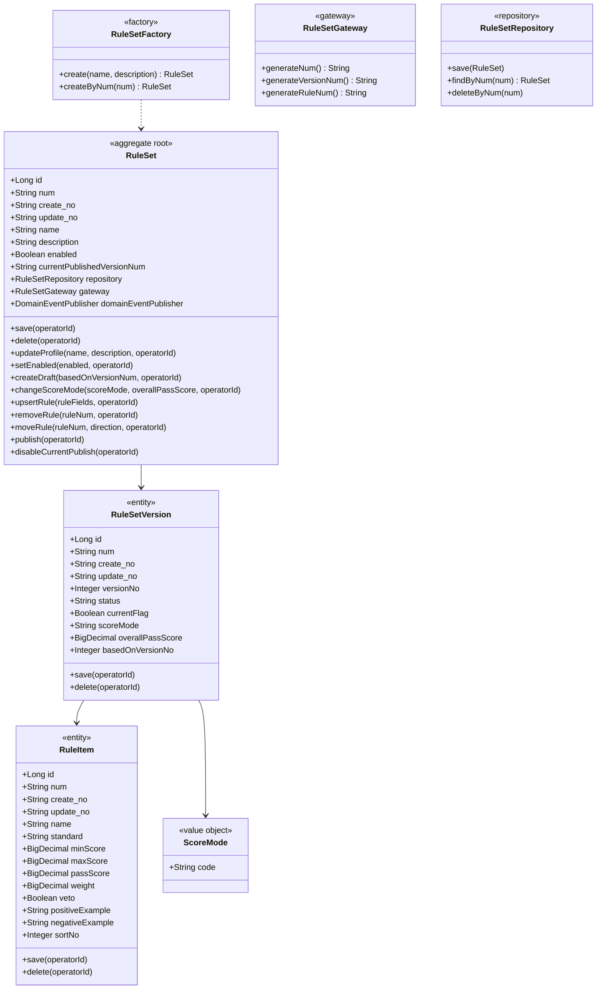
```mermaid
classDiagram
    class RuleSetFactory {
        <<factory>>
        +create(name, description) RuleSet
        +createByNum(num) RuleSet
    }
    class RuleSetGateway {
        <<gateway>>
        +generateNum() String
        +generateVersionNum() String
        +generateRuleNum() String
    }
    class RuleSetRepository {
        <<repository>>
        +save(RuleSet)
        +findByNum(num) RuleSet
        +deleteByNum(num)
    }
    class RuleSet {
        <<aggregate root>>
        +Long id
        +String num
        +String create_no
        +String update_no
        +String name
        +String description
        +Boolean enabled
        +String currentPublishedVersionNum
        +RuleSetRepository repository
        +RuleSetGateway gateway
        +DomainEventPublisher domainEventPublisher
        +save(operatorId)
        +delete(operatorId)
        +updateProfile(name, description, operatorId)
        +setEnabled(enabled, operatorId)
        +createDraft(basedOnVersionNum, operatorId)
        +changeScoreMode(scoreMode, overallPassScore, operatorId)
        +upsertRule(ruleFields, operatorId)
        +removeRule(ruleNum, operatorId)
        +moveRule(ruleNum, direction, operatorId)
        +publish(operatorId)
        +disableCurrentPublish(operatorId)
    }
    class RuleSetVersion {
        <<entity>>
        +Long id
        +String num
        +String create_no
        +String update_no
        +Integer versionNo
        +String status
        +Boolean currentFlag
        +String scoreMode
        +BigDecimal overallPassScore
        +Integer basedOnVersionNo
        +save(operatorId)
        +delete(operatorId)
    }
    class RuleItem {
        <<entity>>
        +Long id
        +String num
        +String create_no
        +String update_no
        +String name
        +String standard
        +BigDecimal minScore
        +BigDecimal maxScore
        +BigDecimal passScore
        +BigDecimal weight
        +Boolean veto
        +String positiveExample
        +String negativeExample
        +Integer sortNo
        +save(operatorId)
        +delete(operatorId)
    }
    class ScoreMode {
        <<value object>>
        +String code
    }
    RuleSetFactory ..> RuleSet
    RuleSet --> RuleSetVersion
    RuleSetVersion --> RuleItem
    RuleSetVersion --> ScoreMode
```

| 对象 | 类型 | 属性要点 | 关系 |
|---|---|---|---|
| RuleSet | 聚合根 | num=`RS-0004` 系统生成；name 用户填；enabled | 1:N Version |
| RuleSetVersion | 实体 | DRAFT 无 versionNo；PUBLISHED 单调版本号；同时最多一个 current 已发布 | 属于 RuleSet |
| RuleItem | 实体 | 分数契约 + 自然语言标准 | 属于 Version |
| ScoreMode | 值对象 | ALL_PASS / WEIGHTED_SUM / VETO_WEIGHTED | 挂在 Version |

软删除字段不进入领域模型。

#### 4.2.2 领域动作

| 聚合/实体 | 领域动作 | 职责 | 前置条件 | 后置条件/规则 | 领域事件 |
|---|---|---|---|---|---|
| RuleSet | save(operatorId) | 持久化聚合 | 通过 domainValidate | 写库 | RULE_SET_SAVED |
| RuleSet | delete(operatorId) | 删除主档 | 无进行中任务依赖（由应用层 Query 预检） | 仓储删除 | RULE_SET_DELETED |
| RuleSet | updateProfile(name, description, operatorId) | 改名称说明 | 已启用或停用皆可 | 编号不变 | RULE_SET_SAVED |
| RuleSet | setEnabled(enabled, operatorId) | 启停 | 停用后新任务不可指定 | current 发布仍保留供历史任务 | RULE_SET_ENABLED_CHANGED |
| RuleSet | createDraft(basedOnVersionNum, operatorId) | 新建草稿或从某版本复制 | 同时仅允许一个 DRAFT | 复制规则与评估分方式 | RULE_SET_DRAFT_CREATED |
| RuleSet | changeScoreMode(scoreMode, overallPassScore, operatorId) | 改评估分方式 | 目标版本必须是 DRAFT | 加权类 overallPassScore&gt;0 | RULE_SET_SAVED |
| RuleSet | upsertRule(..., operatorId) | 增改规则 | DRAFT | min&lt;max，通过分在区间内；加权权重&gt;0 | RULE_SET_SAVED |
| RuleSet | removeRule(ruleNum, operatorId) | 删规则 | DRAFT | — | RULE_SET_SAVED |
| RuleSet | moveRule(ruleNum, direction, operatorId) | 调序 | DRAFT | 只影响展示序 | RULE_SET_SAVED |
| RuleSet | publish(operatorId) | 发布草稿 | 校验完整；至少 1 条规则；红线+加权至少 1 条红线 | 草稿变 PUBLISHED 并 current；旧 current 变 ARCHIVED | RULE_SET_PUBLISHED |
| RuleSet | disableCurrentPublish(operatorId) | 停用当前发布 | 存在 current | currentFlag=false，新任务不可加载 | RULE_SET_PUBLISH_DISABLED |
| RuleSetVersion / RuleItem | save/delete(operatorId) | 随聚合一起持久化 | 仅聚合根对外调用仓储 | — | — |

**时序：createDraft**

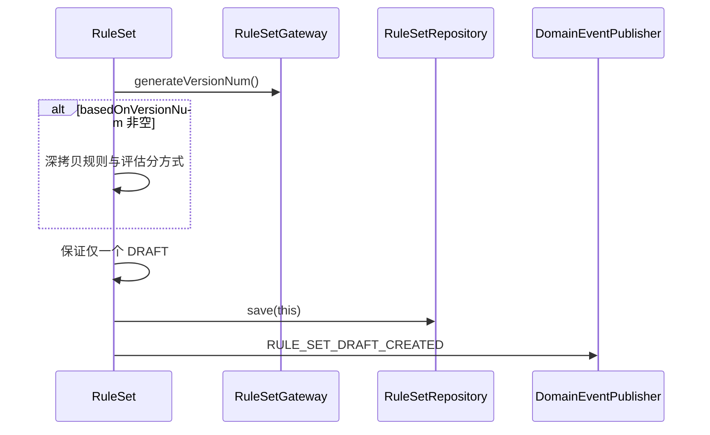
```mermaid
sequenceDiagram
  participant RS as RuleSet
  participant GW as RuleSetGateway
  participant Repo as RuleSetRepository
  participant P as DomainEventPublisher
  RS->>GW: generateVersionNum()
  alt basedOnVersionNum 非空
    RS->>RS: 深拷贝规则与评估分方式
  end
  RS->>RS: 保证仅一个 DRAFT
  RS->>Repo: save(this)
  RS->>P: RULE_SET_DRAFT_CREATED
```

**时序：publish**

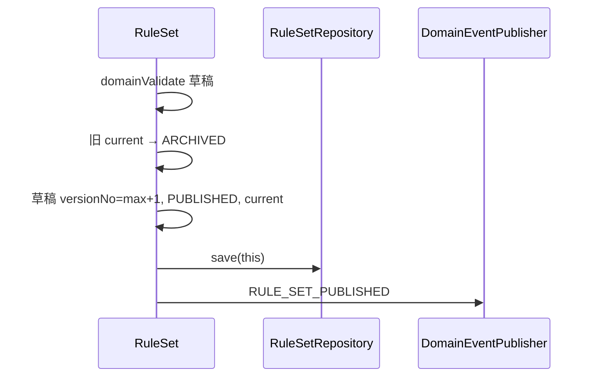
```mermaid
sequenceDiagram
  participant RS as RuleSet
  participant Repo as RuleSetRepository
  participant P as DomainEventPublisher
  RS->>RS: domainValidate 草稿
  RS->>RS: 旧 current → ARCHIVED
  RS->>RS: 草稿 versionNo=max+1, PUBLISHED, current
  RS->>Repo: save(this)
  RS->>P: RULE_SET_PUBLISHED
```

**时序：upsertRule / changeScoreMode / moveRule / removeRule** 均为：校验 DRAFT → 改内存 → `repository.save` → `RULE_SET_SAVED`。

**时序：save / delete / updateProfile / setEnabled / disableCurrentPublish** 均为：校验 → 改状态 → `repository.save` 或 `deleteByNum` → 对应事件。

#### 4.2.3 领域规则

| 聚合/对象 | 规则类型 | 规则描述 | 违反时表达 |
|---|---|---|---|
| RuleSet | 编码 | num 系统生成，创建后不可改 | 抛 BizException |
| RuleSet | 启停 | enabled=false 时不得被新任务指定 | 抛 BizException |
| RuleSetVersion | 草稿唯一 | 同一规则集最多一个 DRAFT | 抛 BizException |
| RuleSetVersion | 发布不可变 | PUBLISHED/ARCHIVED 禁止改规则与评估分方式 | 抛 BizException |
| RuleSetVersion | 当前发布 | 最多一个 currentFlag=true 的 PUBLISHED | 抛 BizException |
| RuleItem | 分数契约 | min&lt;max；pass 落在区间 | 抛 BizException |
| RuleItem | 加权 | WEIGHTED_SUM / VETO_WEIGHTED 时 weight&gt;0，overallPassScore&gt;0 | 抛 BizException |
| RuleItem | 红线 | VETO_WEIGHTED 至少一条 veto=true | 抛 BizException |
| ScoreMode | 红线语义 | 仅 VETO_WEIGHTED 下 veto 参与一票否决且红线不计入加权 | 校验提示，不抛（非该模式忽略 veto） |

#### 4.2.4 领域工厂

| Factory | 方法 | 入参 | 返回 | 职责 | 依赖 |
|---|---|---|---|---|---|
| RuleSetFactory | create | name, description | RuleSet | 用户填写字段构建；num 由动作 save 前 Gateway 生成 | Gateway |
| RuleSetFactory | createByNum | num | RuleSet | Repository.findByNum 重建 | Repository |

`create` **不含** operatorId、num、enabled、版本号。`enabled` 默认 true 在领域对象初始化，不属于用户表单必填时可在工厂内默认。

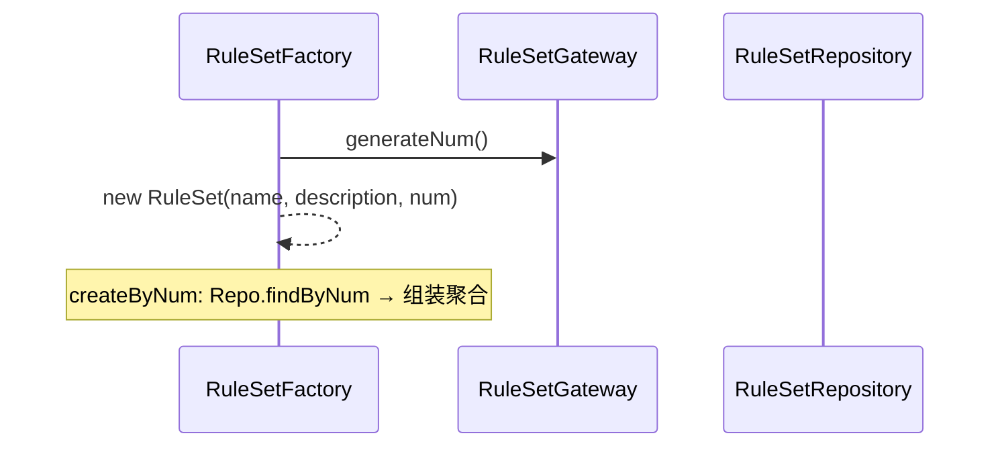
```mermaid
sequenceDiagram
  participant F as RuleSetFactory
  participant GW as RuleSetGateway
  participant Repo as RuleSetRepository
  F->>GW: generateNum()
  F-->>F: new RuleSet(name, description, num)
  Note over F: createByNum: Repo.findByNum → 组装聚合
```

#### 4.2.5 领域网关

| Gateway | 方法 | 入参 | 返回 | 职责 | 外部依赖 | 失败策略 |
|---|---|---|---|---|---|---|
| RuleSetGateway | generateNum | 无 | String | 生成 `RS-`+4 位序号 | DB 序号或 Redis INCR | 失败抛异常，创建中止 |
| RuleSetGateway | generateVersionNum | 无 | String | `RSV-` 前缀 | 同上 | 同上 |
| RuleSetGateway | generateRuleNum | 无 | String | `RUL-` 前缀 | 同上 | 同上 |

#### 4.2.6 领域事件

| 事件名 | 触发时机 | 载荷要点 | 订阅方 |
|---|---|---|---|
| RULE_SET_SAVED | 保存/改规则/改评估分方式 | ruleSetNum | 审计日志（可选） |
| RULE_SET_DRAFT_CREATED | 新建草稿 | ruleSetNum, versionNum | — |
| RULE_SET_PUBLISHED | 发布成功 | ruleSetNum, versionNo | — |
| RULE_SET_ENABLED_CHANGED | 启停 | ruleSetNum, enabled | — |
| RULE_SET_PUBLISH_DISABLED | 停用当前发布 | ruleSetNum | — |
| RULE_SET_DELETED | 删除 | ruleSetNum | — |

---

### 4.3 审核器（auditor）

#### 4.3.1 领域模型

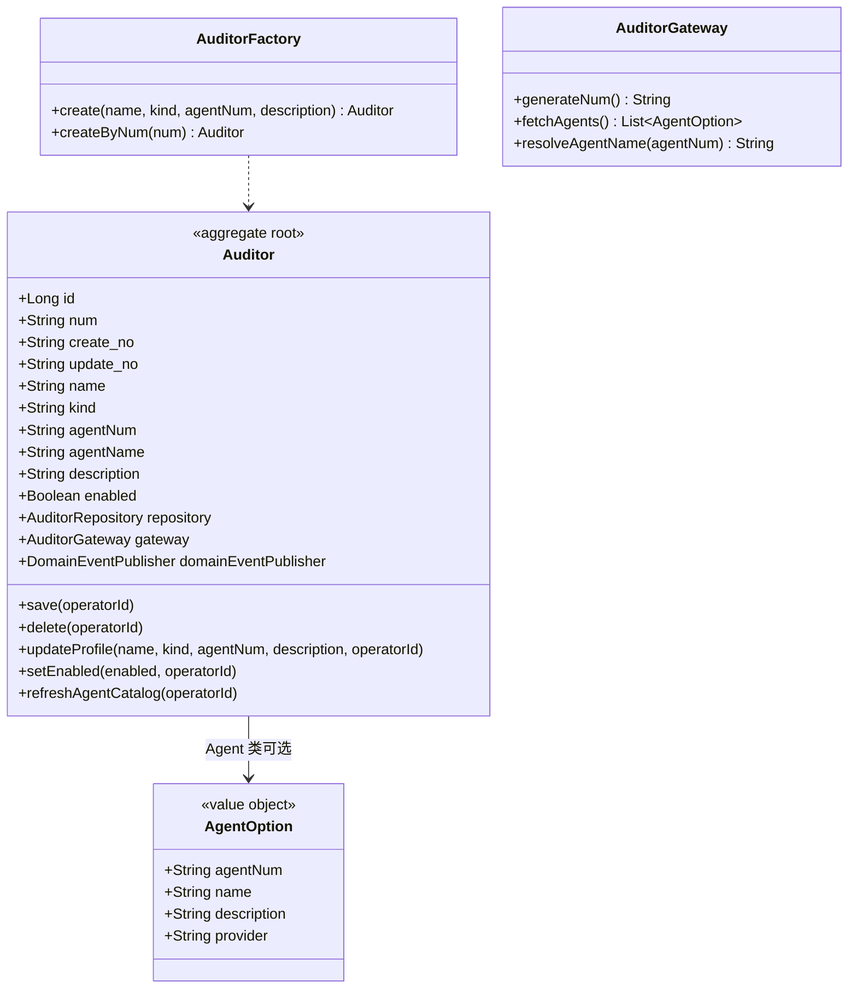
```mermaid
classDiagram
    class AuditorFactory {
        +create(name, kind, agentNum, description) Auditor
        +createByNum(num) Auditor
    }
    class AuditorGateway {
        +generateNum() String
        +fetchAgents() List~AgentOption~
        +resolveAgentName(agentNum) String
    }
    class Auditor {
        <<aggregate root>>
        +Long id
        +String num
        +String create_no
        +String update_no
        +String name
        +String kind
        +String agentNum
        +String agentName
        +String description
        +Boolean enabled
        +AuditorRepository repository
        +AuditorGateway gateway
        +DomainEventPublisher domainEventPublisher
        +save(operatorId)
        +delete(operatorId)
        +updateProfile(name, kind, agentNum, description, operatorId)
        +setEnabled(enabled, operatorId)
        +refreshAgentCatalog(operatorId)
    }
    class AgentOption {
        <<value object>>
        +String agentNum
        +String name
        +String description
        +String provider
    }
    AuditorFactory ..> Auditor
    Auditor --> AgentOption : Agent 类可选
```

| 对象 | 类型 | 属性 | 关系 |
|---|---|---|---|
| Auditor | 聚合根 | kind=`AGENT`/`ORDINARY`；AGENT 必须有 agentNum | 跨聚合被 Evaluation 引用 num |
| AgentOption | 值对象 | 来自 Agent 平台 | 缓存表，非聚合内集合的强一致部分 |

`refreshAgentCatalog` 将 Gateway 拉到的列表交给仓储侧由 infra 写入 `agent_catalog`（实现藏在 GatewayImpl + 本地表，领域只表达「刷新目录」）。

#### 4.3.2 领域动作

| 聚合 | 领域动作 | 职责 | 前置 | 后置 | 事件 |
|---|---|---|---|---|---|
| Auditor | save(operatorId) | 持久化 | AGENT 必须解析到 agentName | — | AUDITOR_SAVED |
| Auditor | delete(operatorId) | 删除 | 应用层确认无在途任务强制绑定 | — | AUDITOR_DELETED |
| Auditor | updateProfile(..., operatorId) | 改定义 | AGENT 必选 agentNum | 普通审核器清空 agent 字段 | AUDITOR_SAVED |
| Auditor | setEnabled(enabled, operatorId) | 启停 | 停用后新任务不可选 | — | AUDITOR_ENABLED_CHANGED |
| Auditor | refreshAgentCatalog(operatorId) | 从平台拉取可选 Agent | — | 本地目录更新 | AGENT_CATALOG_REFRESHED |

**时序：save（创建路径由工厂 create 后调用）**

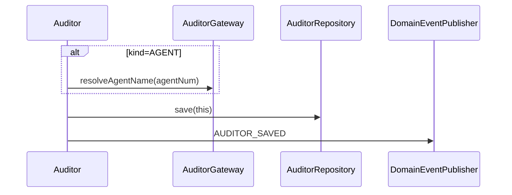
```mermaid
sequenceDiagram
  participant A as Auditor
  participant GW as AuditorGateway
  participant Repo as AuditorRepository
  participant P as DomainEventPublisher
  alt kind=AGENT
    A->>GW: resolveAgentName(agentNum)
  end
  A->>Repo: save(this)
  A->>P: AUDITOR_SAVED
```

**时序：refreshAgentCatalog**

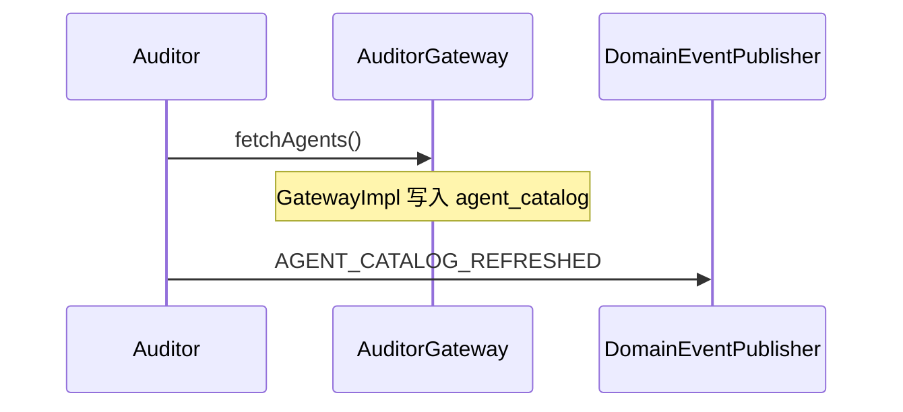
```mermaid
sequenceDiagram
  participant A as Auditor
  participant GW as AuditorGateway
  participant P as DomainEventPublisher
  A->>GW: fetchAgents()
  Note over GW: GatewayImpl 写入 agent_catalog
  A->>P: AGENT_CATALOG_REFRESHED
```

**时序：updateProfile / setEnabled / delete** 同「改状态 → save/deleteByNum → 事件」。

#### 4.3.3 领域规则

| 对象 | 规则类型 | 描述 | 违反 |
|---|---|---|---|
| Auditor | 类型 | kind 只能 AGENT / ORDINARY | BizException |
| Auditor | Agent | AGENT 必须 agentNum 非空且目录中存在 | BizException |
| Auditor | 普通 | ORDINARY 不得绑定 Agent | 保存时清空 |
| Auditor | 启用 | enabled=false 不可被新任务选用 | BizException（在 Evaluation 侧也校验） |

#### 4.3.4 领域工厂

| Factory | 方法 | 入参 | 返回 | 职责 |
|---|---|---|---|---|
| AuditorFactory | create | name, kind, agentNum, description | Auditor | 仅用户填写字段；num 由 Gateway 生成 |
| AuditorFactory | createByNum | num | Auditor | findByNum |

#### 4.3.5 领域网关

| 方法 | 入参 | 返回 | 职责 | 外部依赖 | 失败 |
|---|---|---|---|---|---|
| generateNum | — | String | `AUD-` 编号 | Redis/DB | 中止创建 |
| fetchAgents | — | List | 拉 Agent 平台列表 | Agent HTTP；Mock 返回内置三条 | 失败保留旧目录并抛 |
| resolveAgentName | agentNum | String | 名称快照 | 本地目录或平台 | 找不到则抛 |

本期 **MockAuditorGateway**：内置「文档质量审核 Agent / 风险合规审核 Agent / 通用文本审核 Agent」。

#### 4.3.6 领域事件

| 事件 | 时机 | 载荷 | 订阅 |
|---|---|---|---|
| AUDITOR_SAVED | 创建/编辑 | auditorNum | — |
| AUDITOR_ENABLED_CHANGED | 启停 | auditorNum, enabled | — |
| AUDITOR_DELETED | 删除 | auditorNum | — |
| AGENT_CATALOG_REFRESHED | 同步目录 | count | — |

---

### 4.4 审核任务（evaluation）

#### 4.4.1 领域模型

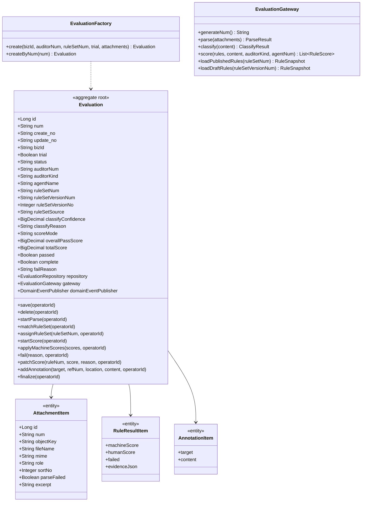
```mermaid
classDiagram
    class EvaluationFactory {
        +create(bizId, auditorNum, ruleSetNum, trial, attachments) Evaluation
        +createByNum(num) Evaluation
    }
    class EvaluationGateway {
        +generateNum() String
        +parse(attachments) ParseResult
        +classify(content) ClassifyResult
        +score(rules, content, auditorKind, agentNum) List~RuleScore~
        +loadPublishedRules(ruleSetNum) RuleSnapshot
        +loadDraftRules(ruleSetVersionNum) RuleSnapshot
    }
    class Evaluation {
        <<aggregate root>>
        +Long id
        +String num
        +String create_no
        +String update_no
        +String bizId
        +Boolean trial
        +String status
        +String auditorNum
        +String auditorKind
        +String agentName
        +String ruleSetNum
        +String ruleSetVersionNum
        +Integer ruleSetVersionNo
        +String ruleSetSource
        +BigDecimal classifyConfidence
        +String classifyReason
        +String scoreMode
        +BigDecimal overallPassScore
        +BigDecimal totalScore
        +Boolean passed
        +Boolean complete
        +String failReason
        +EvaluationRepository repository
        +EvaluationGateway gateway
        +DomainEventPublisher domainEventPublisher
        +save(operatorId)
        +delete(operatorId)
        +startParse(operatorId)
        +matchRuleSet(operatorId)
        +assignRuleSet(ruleSetNum, operatorId)
        +startScore(operatorId)
        +applyMachineScores(scores, operatorId)
        +fail(reason, operatorId)
        +patchScore(ruleNum, score, reason, operatorId)
        +addAnnotation(target, refNum, location, content, operatorId)
        +finalize(operatorId)
    }
    class AttachmentItem {
        <<entity>>
        +Long id
        +String num
        +String objectKey
        +String fileName
        +String mime
        +String role
        +Integer sortNo
        +Boolean parseFailed
        +String excerpt
    }
    class RuleResultItem {
        <<entity>>
        +machineScore
        +humanScore
        +failed
        +evidenceJson
    }
    class AnnotationItem {
        <<entity>>
        +target
        +content
    }
    EvaluationFactory ..> Evaluation
    Evaluation --> AttachmentItem
    Evaluation --> RuleResultItem
    Evaluation --> AnnotationItem
```

状态：`RECEIVED` → `PARSING` → `CLASSIFYING` | `SCORING` → `TYPE_PENDING` | `SCORED` | `FAILED`；`SCORED` → `FINALIZED`。对外仍可用 PRD 小写 JSON（`type_pending` 等），领域枚举与之映射。

#### 4.4.2 领域动作

| 动作 | 职责 | 前置 | 后置 | 事件 |
|---|---|---|---|---|
| save / delete | 持久化/删除试评或误单 | delete 仅 trial 或管理员策略 | — | EVALUATION_SAVED / DELETED |
| startParse | 解析 TOS 对象 | RECEIVED | 全失败 → fail；否则进入匹配或打分 | EVALUATION_PARSED |
| matchRuleSet | 未指定则自动匹配 | 已解析 | 低置信度 TYPE_PENDING；否则绑定已发布版本 | EVALUATION_CLASSIFIED |
| assignRuleSet | 指定/重评规则集 | TYPE_PENDING 或 SCORED 未锁定 | 清人工分，重新 startScore | EVALUATION_RECLASSIFIED |
| startScore | 加载规则快照并逐条打分 | 已绑定可用发布或试评草稿 | 调 Gateway.score | — |
| applyMachineScores | 写入逐条结果并汇总 | SCORING | SCORED；按评估分方式算 passed | EVALUATION_SCORED |
| fail | 失败终态 | 进行中 | FAILED | EVALUATION_FAILED |
| patchScore | 人工改分即时重算 | SCORED | 展示分用人分 | EVALUATION_UPDATED |
| addAnnotation | 标注不改分 | SCORED | — | EVALUATION_UPDATED |
| finalize | 锁定 | SCORED | FINALIZED 只读 | EVALUATION_FINALIZED |

试评 `trial=true`：**不发** Webhook 事件（发布器仍发领域事件，监听器跳过外呼）。

**时序：startParse**

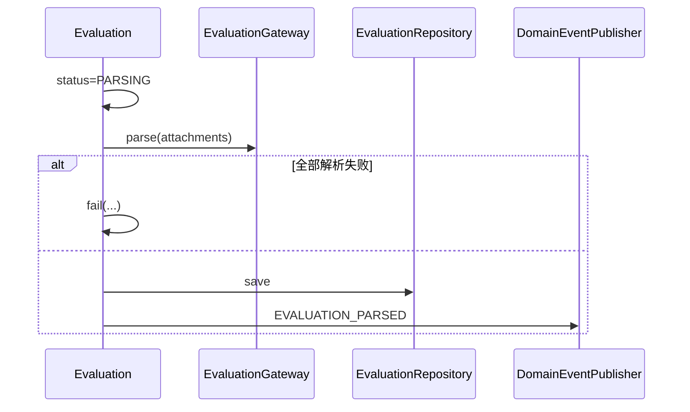
```mermaid
sequenceDiagram
  participant E as Evaluation
  participant GW as EvaluationGateway
  participant Repo as EvaluationRepository
  participant P as DomainEventPublisher
  E->>E: status=PARSING
  E->>GW: parse(attachments)
  alt 全部解析失败
    E->>E: fail(...)
  else
    E->>Repo: save
    E->>P: EVALUATION_PARSED
  end
```

**时序：matchRuleSet**

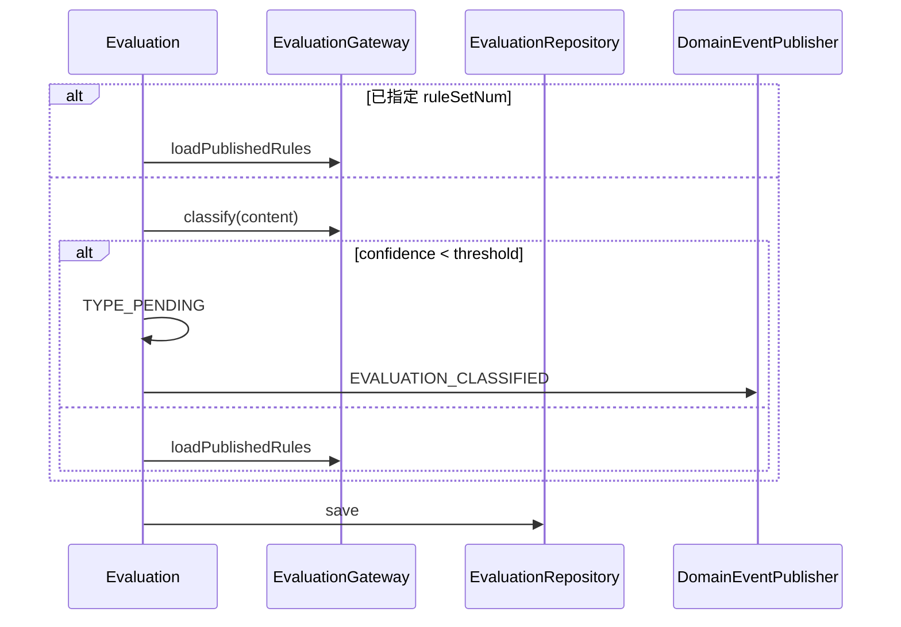
```mermaid
sequenceDiagram
  participant E as Evaluation
  participant GW as EvaluationGateway
  participant Repo as EvaluationRepository
  participant P as DomainEventPublisher
  alt 已指定 ruleSetNum
    E->>GW: loadPublishedRules
  else
    E->>GW: classify(content)
    alt confidence < threshold
      E->>E: TYPE_PENDING
      E->>P: EVALUATION_CLASSIFIED
    else
      E->>GW: loadPublishedRules
    end
  end
  E->>Repo: save
```

**时序：startScore + applyMachineScores**

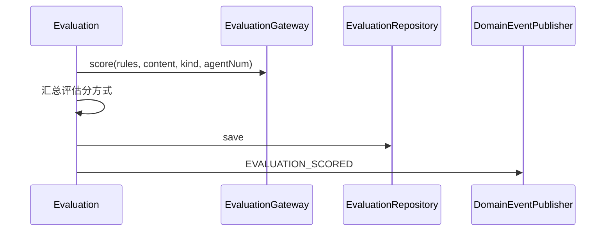
```mermaid
sequenceDiagram
  participant E as Evaluation
  participant GW as EvaluationGateway
  participant Repo as EvaluationRepository
  participant P as DomainEventPublisher
  E->>GW: score(rules, content, kind, agentNum)
  E->>E: 汇总评估分方式
  E->>Repo: save
  E->>P: EVALUATION_SCORED
```

**时序：patchScore**

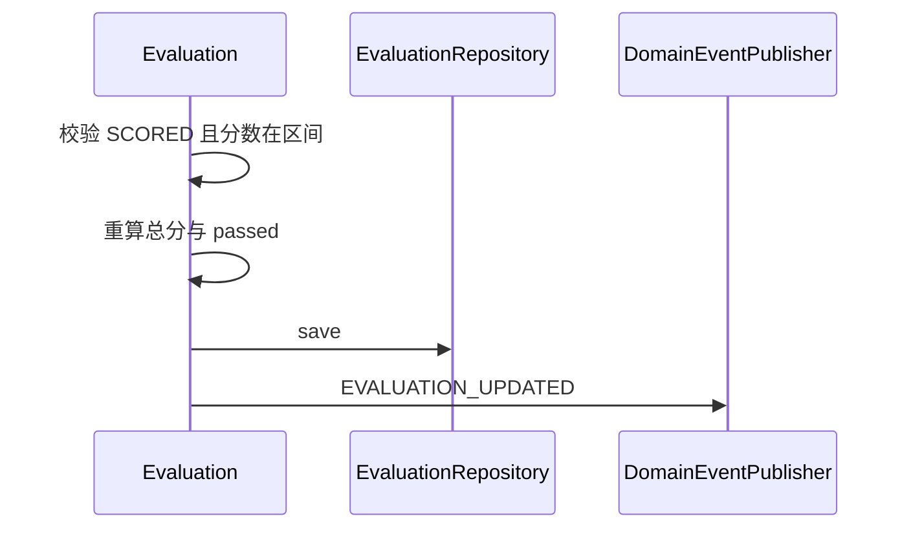
```mermaid
sequenceDiagram
  participant E as Evaluation
  participant Repo as EvaluationRepository
  participant P as DomainEventPublisher
  E->>E: 校验 SCORED 且分数在区间
  E->>E: 重算总分与 passed
  E->>Repo: save
  E->>P: EVALUATION_UPDATED
```

**时序：finalize / addAnnotation / assignRuleSet / fail / save / delete** 均为状态校验 → 变更 → save → 对应事件。`assignRuleSet` 随后由应用层再次调用 `startScore`。

#### 4.4.3 领域规则

| 对象 | 规则 | 违反 |
|---|---|---|
| Evaluation | 非试评同一接入凭证下 bizId 幂等（应用层预检后领域拒绝第二份） | 返回已有 num，不新开打分 |
| Evaluation | 必须绑定已启用审核器 | BizException |
| Evaluation | 指定规则集必须 enabled 且有 current 发布（试评可用草稿） | fail 或拒绝创建 |
| Evaluation | FINALIZED 禁止改分/标注/重评 | BizException |
| RuleResultItem | 机评/人评分必须落在规则区间 | BizException |
| 汇总 | ALL_PASS：全员达通过分；WEIGHTED_SUM：Σ(展示分×权重)；VETO_WEIGHTED：红线全过且非红线加权达线，红线不计入加权 | 写 passed |
| 不完整 | 任一条 failed：complete=false；ALL_PASS 或红线失败不得 passed=true | — |
| 全部规则失败 | status=FAILED | — |
| 证据 | 成功机评尽量带 fileNum；位置可「未定位」 | — |
| 试评 | 不触发 Webhook 监听外呼 | 监听器判断 trial |

#### 4.4.4 领域工厂

| 方法 | 入参（仅用户/调用方可填） | 返回 |
|---|---|---|
| create | bizId, auditorNum, ruleSetNum（可空）, trial, attachments（文件名/role/objectKey） | Evaluation |
| createByNum | num | Evaluation |

num、status、快照字段由领域动作填充，不进 `create` 入参。

#### 4.4.5 领域网关

| 方法 | 职责 | 外部依赖 | 失败 |
|---|---|---|---|
| generateNum | `EVL-` / 试评 `TRL-` | Redis INCR | 中止 |
| parse | 从 TOS 拉对象解析文本 | TOS + 解析器（PDF/Word） | 单文件失败标记 parseFailed |
| classify | 未指定规则集时匹配 | 规则集特征库 / 轻量模型；本期可用规则+文件名启发式，接口保持不变 | 低置信度不抛，返回 confidence |
| loadPublishedRules | 读当前发布快照 DTO | 跨聚合：GatewayImpl 调 RuleSet Mapper（infra 内），**不**让 domain 依赖另一 Repository | 无发布则抛，领域 fail |
| loadDraftRules | 试评草稿 | 同上 | 无草稿抛 |
| score | AGENT 调 Agent；ORDINARY 基线分 | Agent HTTP 或 Mock；普通不调模型 | 单条失败记 failed |

**普通审核器：** 按可解析附件占比在规则区间内给基线分，再走同一套汇总。**Agent 审核器：** 一条规则一次调用，专家界面不出现 Prompt。

#### 4.4.6 领域事件

| 事件 | 时机 | 载荷 | 订阅 |
|---|---|---|---|
| EVALUATION_SAVED | 创建落库 | evaluationNum, bizId, trial | PipelineListener 启动流水线 |
| EVALUATION_PARSED | 解析结束 | evaluationNum | Pipeline 下一步 |
| EVALUATION_CLASSIFIED | 匹配结束（含 pending） | evaluationNum, source, pending | Webhook enqueue（非 trial） |
| EVALUATION_SCORED | 机评完成 | evaluationNum, passed, complete | Webhook scored |
| EVALUATION_UPDATED | 改分或标注 | evaluationNum | Webhook updated |
| EVALUATION_FINALIZED | 锁定 | evaluationNum | Webhook finalized |
| EVALUATION_FAILED | 失败 | evaluationNum, reason | Webhook failed |
| EVALUATION_RECLASSIFIED | 指定规则集 | evaluationNum | 流水线重打分 |

Webhook 事件名与 PRD 对齐：`evaluation.classified|scored|updated|finalized|failed`。

---

### 4.5 接入（access）

#### 4.5.1 领域模型

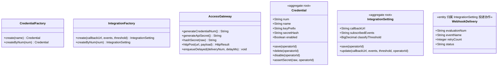
```mermaid
classDiagram
    class CredentialFactory {
        +create(name) Credential
        +createByNum(num) Credential
    }
    class IntegrationFactory {
        +create(callbackUrl, events, threshold) IntegrationSetting
        +createByNum(num) IntegrationSetting
    }
    class AccessGateway {
        +generateCredentialNum() String
        +generateApiSecret() String
        +hashSecret(raw) String
        +httpPost(url, payload) HttpResult
        +enqueueDelayed(deliveryNum, delayMs) void
    }
    class Credential {
        <<aggregate root>>
        +String num
        +String name
        +String keyPrefix
        +String secretHash
        +Boolean enabled
        +save(operatorId)
        +delete(operatorId)
        +disable(operatorId)
        +assertSecret(raw, operatorId)
    }
    class IntegrationSetting {
        <<aggregate root>>
        +String callbackUrl
        +String subscribedEvents
        +BigDecimal classifyThreshold
        +save(operatorId)
        +update(callbackUrl, events, threshold, operatorId)
    }
    class WebhookDelivery {
        <<entity 归属 IntegrationSetting 投递协作>>
        +String evaluationNum
        +String eventName
        +Integer retryCount
        +String status
    }
```

单租户下 IntegrationSetting 使用固定 num=`INT-DEFAULT`，首次 `create` 初始化。

WebhookDelivery 作为 IntegrationSetting 的协作实体，由领域动作 `enqueueDelivery` / `dispatchOne` / `replayDead` 维护。仓储实现**只加载当前动作涉及的投递行**（按 num 或到期扫描得到的 num 列表），不得把历史投递一次性载入聚合。

#### 4.5.2 领域动作

| 聚合 | 动作 | 职责 | 前置 | 后置 | 事件 |
|---|---|---|---|---|---|
| Credential | save | 创建后仅此时可对外回传 rawSecret（应用层内存传递，不落领域持久化明文） | name 非空 | secretHash 落库 | CREDENTIAL_CREATED |
| Credential | disable / delete | 停用或删除 | — | 请求 401 | CREDENTIAL_DISABLED |
| Credential | assertSecret | 校验 | enabled | — | — |
| IntegrationSetting | update | 改回调与订阅 | URL 合法 | — | INTEGRATION_UPDATED |
| IntegrationSetting | enqueueDelivery | 入队 | 非 trial 且事件已订阅 | PENDING | WEBHOOK_ENQUEUED |
| IntegrationSetting | issuePresign | 签发 TOS 上传 URL | 文件名与大小合法 | 返回 objectKey 与 PUT URL | — |
| IntegrationSetting | dispatchOne | HTTP 投递 | PENDING/RETRY | SUCCESS 或延期 | WEBHOOK_SENT / WEBHOOK_FAILED |
| IntegrationSetting | replayDead | 死信重放 | DEAD | 重新 PENDING | WEBHOOK_ENQUEUED |

**时序：enqueueDelivery**

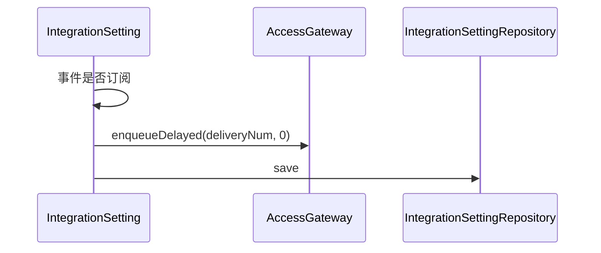
```mermaid
sequenceDiagram
  participant I as IntegrationSetting
  participant GW as AccessGateway
  participant Repo as IntegrationSettingRepository
  I->>I: 事件是否订阅
  I->>GW: enqueueDelayed(deliveryNum, 0)
  I->>Repo: save
```

**时序：dispatchOne**

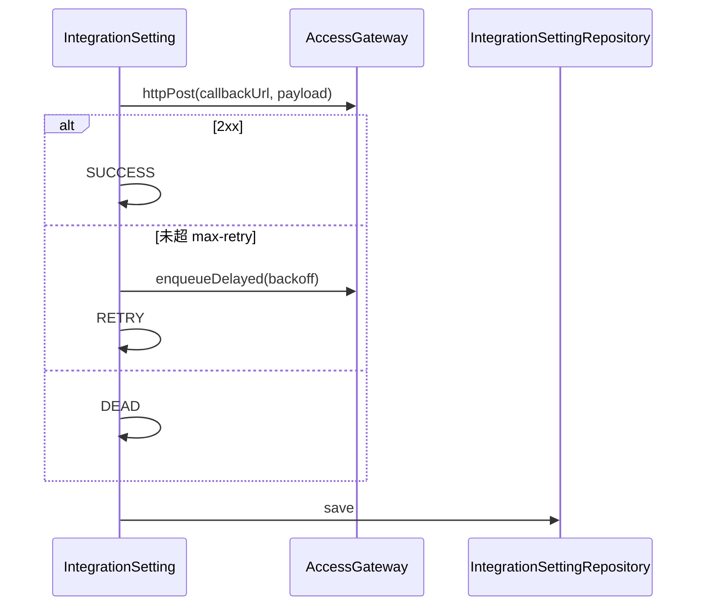
```mermaid
sequenceDiagram
  participant I as IntegrationSetting
  participant GW as AccessGateway
  participant Repo as IntegrationSettingRepository
  I->>GW: httpPost(callbackUrl, payload)
  alt 2xx
    I->>I: SUCCESS
  else 未超 max-retry
    I->>GW: enqueueDelayed(backoff)
    I->>I: RETRY
  else
    I->>I: DEAD
  end
  I->>Repo: save
```

其余动作：校验 → save → 事件。

#### 4.5.3 领域规则

| 对象 | 规则 | 违反 |
|---|---|---|
| Credential | 明文密钥只在创建响应出现一次 | 不落库 |
| Credential | disabled 拒绝开放 API | 401 |
| IntegrationSetting | 未订阅事件不投递 | 跳过 |
| WebhookDelivery | trial 任务不入队 | 跳过 |
| WebhookDelivery | 投递失败不影响任务分数 | 只改投递状态 |

#### 4.5.4 领域工厂

| Factory | create 入参 | createByNum |
|---|---|---|
| CredentialFactory | name | num |
| IntegrationSettingFactory | callbackUrl, subscribedEventsCsv, classifyThreshold | num |

#### 4.5.5 领域网关

| 方法 | 职责 | 依赖 | 失败 |
|---|---|---|---|
| generateCredentialNum | `AK-` | Redis | 中止 |
| generateApiSecret | 随机密钥 | 安全随机 | 中止 |
| hashSecret | 单向哈希 | 内部 | — |
| httpPost | 回调 | JDK HttpClient | 记 status |
| enqueueDelayed | Redis 延迟队列 | Redisson | 写库 PENDING 由定时任务兜底 |

#### 4.5.6 领域事件

| 事件 | 时机 | 订阅 |
|---|---|---|
| CREDENTIAL_CREATED / DISABLED | 凭证生命周期 | 审计 |
| INTEGRATION_UPDATED | 改回调 | — |
| WEBHOOK_ENQUEUED / SENT / FAILED | 投递 | 监控告警（FAILED/DEAD） |

---

**领域层自检：** 四领域均含模型/动作/规则/工厂（仅 create+createByNum）/网关/事件；聚合根含 id/num/create_no/update_no 与三类协作依赖；无领域软删除字段。通过。

---

## 5. 基础设施层设计

| 类型 | 类名 | 包 | 职责 | 依赖 | 对应表/外部 | 新增 |
|---|---|---|---|---|---|---|
| Entity | RuleSetEntity / RuleSetVersionEntity / RuleItemEntity | infra.ruleset | 表映射 | MP | rule_set 等 | 新增 |
| Mapper | RuleSetMapper 等 | infra.ruleset | LambdaQuery/Update | MP | 同上 | 新增 |
| RepositoryImpl | RuleSetRepositoryImpl | infra.ruleset | Entity↔领域；仅 save/findByNum/deleteByNum | Mapper | 同上 | 新增 |
| FactoryImpl | RuleSetFactoryImpl | infra.ruleset | create / createByNum | Gateway, Repository | — | 新增 |
| GatewayImpl | RuleSetGatewayImpl | infra.ruleset | 编号 INCR | Redis | — | 新增 |
| Entity/Mapper/Repo/Factory/GW | Auditor* | infra.auditor | 审核器 | MP/Redis | auditor, agent_catalog | 新增 |
| GatewayImpl | MockAgentPlatformClient + AuditorGatewayImpl | infra.auditor | Mock Agent 列表 | 配置开关 | Agent 平台 | 新增 |
| Entity/Mapper/Repo/Factory/GW | Evaluation* | infra.evaluation | 任务聚合落库 | MP | evaluation* | 新增 |
| GatewayImpl | TosObjectGateway / DocumentParseGateway / ScoringGatewayImpl | infra.evaluation | TOS、PDF/Word 解析、Agent/普通打分 | TOS SDK、解析库 | TOS, Agent | 新增 |
| Entity/Mapper/Repo/Factory/GW | Credential* / IntegrationSetting* / WebhookDeliveryEntity | infra.access | 凭证与投递 | MP, Redis | credential 等 | 新增 |
| common | DomainEventPublisherImpl | infra.common.event | Spring 事件 | — | — | 新增 |
| common | RedisLockHelper | infra.common.lock | Redisson RLock | Redis | — | 新增 |
| common | PipelineExecutor | infra.evaluation | `@Async` 线程池 | 配置 | — | 新增 |

**Mapper 规约：** 只用 `LambdaQueryWrapper` / `LambdaUpdateWrapper`。  
**RepositoryImpl：** 不作为 application 查询入口。  
**注入：** `@Resource`。  
**编号：** `INCR audit:num:ruleset` 等，格式 `RS-{4位}`。

解析：PDF/Word 用 Apache Tika 或 PDFBox + POI（infra 引入，domain 不依赖）。Agent 调用超时 `audit.agent.timeout-ms`。

---

**基础设施自检：** 每聚合均有 Entity/Mapper/RepoImpl/FactoryImpl/GatewayImpl；Webhook 用 Redis 延迟队列 + 表状态。通过。

---

## 6. 应用层设计

### 6.1 业务模块划分

| 模块 | CommandService | QueryService |
|---|---|---|
| ruleset | RuleSetCommandService | RuleSetQueryService |
| auditor | AuditorCommandService | AuditorQueryService |
| evaluation | EvaluationCommandService | EvaluationQueryService |
| access | AccessCommandService | AccessQueryService |

应用层**禁止**注入 Repository / Gateway。写方法：校验 → Redisson 锁 → 事务内 Factory → 领域动作 → 解锁。入参均为 `*ParamDTO`，返回 `*DTO` 或 `String num`。

锁 key 示例：`lock:ruleset:{num}`、`lock:eval:{num}`、`lock:eval:biz:{apiKeyNum}:{bizId}`。

---

### 6.2 规则集（ruleset）

#### 6.2.1 Service 方法清单

| 服务 | 方法 | 入参 | 返回 | 职责 | 事务 | 锁 |
|---|---|---|---|---|---|---|
| RuleSetCommandService | create | RuleSetCreateParamDTO | String num | 创建主档+空草稿 | 是 | name 级短锁 |
| RuleSetCommandService | updateProfile | RuleSetUpdateParamDTO | void | 改名称说明 | 是 | ruleset num |
| RuleSetCommandService | setEnabled | RuleSetEnabledParamDTO | void | 启停 | 是 | ruleset num |
| RuleSetCommandService | createDraft | RuleSetDraftParamDTO | String versionNum | 新建/复制草稿 | 是 | ruleset num |
| RuleSetCommandService | changeScoreMode | RuleSetScoreModeParamDTO | void | 评估分方式 | 是 | ruleset num |
| RuleSetCommandService | upsertRule | RuleUpsertParamDTO | String ruleNum | 增改规则 | 是 | ruleset num |
| RuleSetCommandService | removeRule | RuleRemoveParamDTO | void | 删规则 | 是 | ruleset num |
| RuleSetCommandService | moveRule | RuleMoveParamDTO | void | 调序 | 是 | ruleset num |
| RuleSetCommandService | publish | RuleSetNumParamDTO | Integer versionNo | 发布 | 是 | ruleset num |
| RuleSetCommandService | disableCurrent | RuleSetNumParamDTO | void | 停用当前发布 | 是 | ruleset num |
| RuleSetQueryService | page | RuleSetPageParamDTO | PageResult&lt;RuleSetDTO&gt; | 列表 | 否 | 无 |
| RuleSetQueryService | detail | RuleSetNumParamDTO | RuleSetDetailDTO | 主档+版本列表 | 否 | 无 |
| RuleSetQueryService | versionDetail | RuleSetVersionNumParamDTO | RuleSetVersionDTO | 规则清单 | 否 | 无 |

#### 6.2.2 方法时序逻辑

**create（代表命令）**

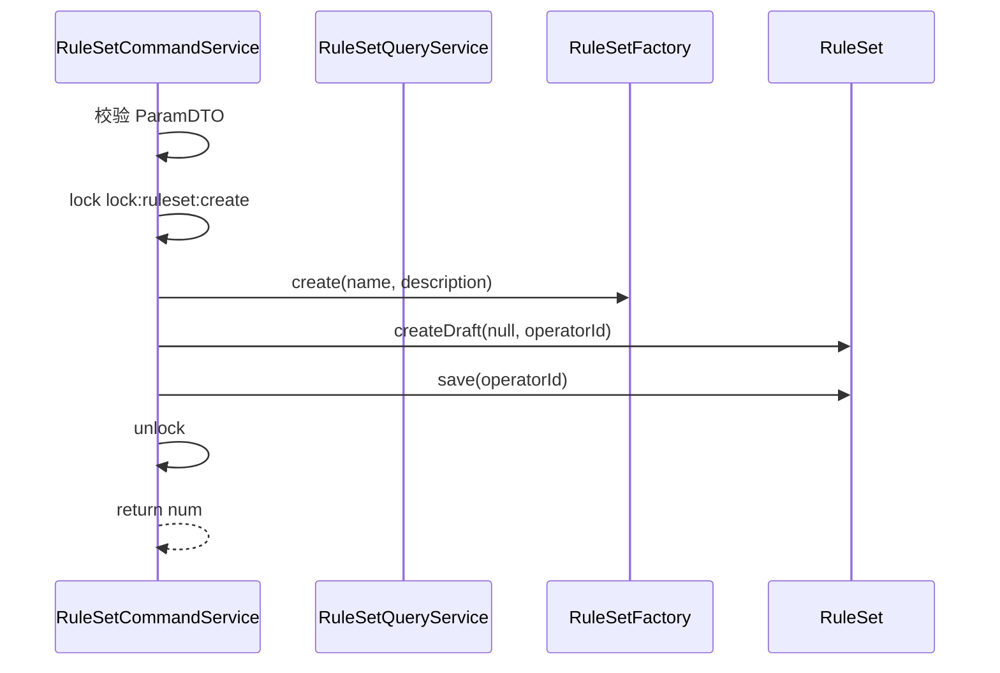
```mermaid
sequenceDiagram
  participant C as RuleSetCommandService
  participant Q as RuleSetQueryService
  participant F as RuleSetFactory
  participant RS as RuleSet
  C->>C: 校验 ParamDTO
  C->>C: lock lock:ruleset:create
  C->>F: create(name, description)
  C->>RS: createDraft(null, operatorId)
  C->>RS: save(operatorId)
  C->>C: unlock
  C-->>C: return num
```

**publish**

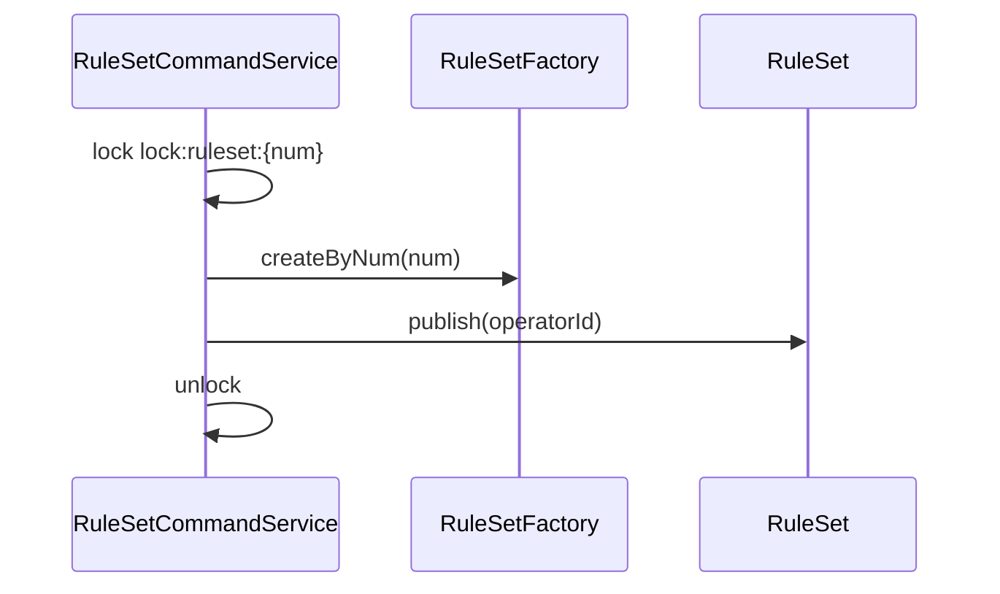
```mermaid
sequenceDiagram
  participant C as RuleSetCommandService
  participant F as RuleSetFactory
  participant RS as RuleSet
  C->>C: lock lock:ruleset:{num}
  C->>F: createByNum(num)
  C->>RS: publish(operatorId)
  C->>C: unlock
```

其余写方法同「加锁 → createByNum → 对应领域动作 → 解锁」。

**page / detail / versionDetail（查询同一模式）**

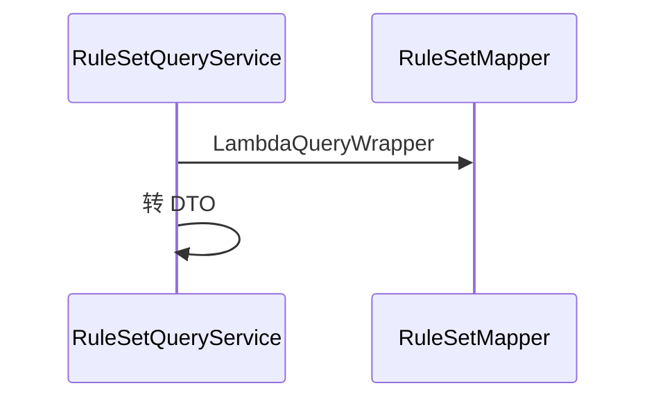
```mermaid
sequenceDiagram
  participant Q as RuleSetQueryService
  participant M as RuleSetMapper
  Q->>M: LambdaQueryWrapper
  Q->>Q: 转 DTO
```

---

### 6.3 审核器（auditor）

#### 6.3.1 方法清单

| 服务 | 方法 | 入参 | 返回 | 事务 | 锁 |
|---|---|---|---|---|---|
| AuditorCommandService.create | AuditorCreateParamDTO | String num | 是 | create |
| AuditorCommandService.update | AuditorUpdateParamDTO | void | 是 | auditor num |
| AuditorCommandService.setEnabled | AuditorEnabledParamDTO | void | 是 | auditor num |
| AuditorCommandService.syncAgentCatalog | Operator 空参 DTO | Integer count | 是 | lock:agent-catalog |
| AuditorQueryService.page | AuditorPageParamDTO | PageResult | 否 | 无 |
| AuditorQueryService.detail | AuditorNumParamDTO | AuditorDTO | 否 | 无 |
| AuditorQueryService.listAgents | 无业务入参 DTO | List&lt;AgentOptionDTO&gt; | 否 | 无 |

`listAgents` 只读 `agent_catalog` Mapper，不调 Gateway。目录靠 `syncAgentCatalog` 或启动时 Command 同步。

#### 6.3.2 时序

**create**

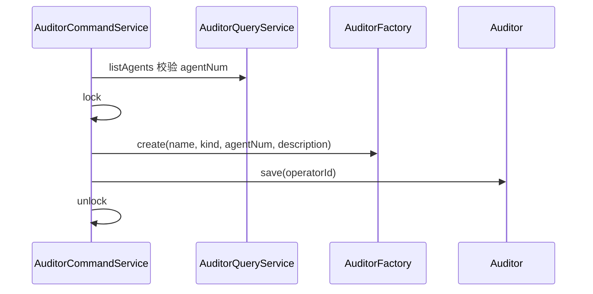
```mermaid
sequenceDiagram
  participant C as AuditorCommandService
  participant Q as AuditorQueryService
  participant F as AuditorFactory
  participant A as Auditor
  C->>Q: listAgents 校验 agentNum
  C->>C: lock
  C->>F: create(name, kind, agentNum, description)
  C->>A: save(operatorId)
  C->>C: unlock
```

**syncAgentCatalog**

```mermaid
sequenceDiagram
  participant C as AuditorCommandService
  participant F as AuditorFactory
  participant A as Auditor
  Note over C: 取任意启用审核器或系统占位 AR 调用 refresh
  C->>F: createByNum(系统同步占位 num) 或 create 后 refresh
  C->>A: refreshAgentCatalog(operatorId)
```

同步占位：预置 `AUD-SYS` 仅用于触发 Gateway 拉目录（DML 初始化），不在任务中选用。

查询 page/detail/listAgents：Mapper → DTO（同 6.2.2 查询图）。

---

### 6.4 审核任务（evaluation）

#### 6.4.1 方法清单

| 服务 | 方法 | 入参 | 返回 | 事务 | 锁 |
|---|---|---|---|---|---|
| EvaluationCommandService.create | EvaluationCreateParamDTO | EvaluationCreatedDTO | 是 | bizId 幂等锁 |
| EvaluationCommandService.runPipeline | EvaluationNumParamDTO | void | 是（分段） | eval num |
| EvaluationCommandService.patchScore | EvaluationScoreParamDTO | void | 是 | eval num |
| EvaluationCommandService.annotate | EvaluationAnnotateParamDTO | void | 是 | eval num |
| EvaluationCommandService.finalize | EvaluationNumParamDTO | void | 是 | eval num |
| EvaluationCommandService.assignRuleSet | EvaluationAssignParamDTO | void | 是 | eval num |
| EvaluationQueryService.page | EvaluationPageParamDTO | PageResult | 否 | 无 |
| EvaluationQueryService.detail | EvaluationNumParamDTO | EvaluationDetailDTO | 否 | 无 |
| EvaluationQueryService.getByBizId | EvaluationBizQueryParamDTO | EvaluationDetailDTO | 否 | 无 |

`create`：非试评若已存在相同 bizId，**直接返回已有任务**（幂等），不调用领域二次打分。

`runPipeline`：由监听器调用；内部 `startParse` → `matchRuleSet` → `startScore`/`applyMachineScores`，按状态机步进，每步 save。

#### 6.4.2 时序

**create**

```mermaid
sequenceDiagram
  participant C as EvaluationCommandService
  participant AQ as AuditorQueryService
  participant RQ as RuleSetQueryService
  participant EQ as EvaluationQueryService
  participant F as EvaluationFactory
  participant E as Evaluation
  C->>C: lock lock:eval:biz:{credential}:{bizId}
  C->>EQ: getByBizId（非试评）
  alt 已存在
    C-->>C: 返回原 num
  else
    C->>AQ: detail 审核器可用
    opt 指定规则集
      C->>RQ: 已发布版本存在
    end
    C->>F: create(...)
    C->>E: save(operatorId)
  end
  C->>C: unlock
```

**runPipeline**

```mermaid
sequenceDiagram
  participant L as PipelineListener
  participant C as EvaluationCommandService
  participant F as EvaluationFactory
  participant E as Evaluation
  L->>C: runPipeline(num)
  C->>C: lock lock:eval:pipeline:{num}
  C->>F: createByNum
  C->>E: startParse / matchRuleSet / startScore / applyMachineScores
  C->>C: unlock
```

**patchScore / annotate / finalize / assignRuleSet**：加锁 → createByNum → 领域动作 → 解锁。`assignRuleSet` 成功后同一锁内再 `startScore`。

**page / detail / getByBizId**：Mapper → DTO。

---

### 6.5 接入（access）

#### 6.5.1 方法清单

| 服务 | 方法 | 入参 | 返回 | 事务 | 锁 |
|---|---|---|---|---|---|
| AccessCommandService.presignUpload | PresignParamDTO | PresignDTO | 否 | objectKey 级 |
| AccessCommandService.createCredential | CredentialCreateParamDTO | CredentialSecretDTO | 是 | create |
| AccessCommandService.disableCredential | CredentialNumParamDTO | void | 是 | credential num |
| AccessCommandService.updateIntegration | IntegrationUpdateParamDTO | void | 是 | INT-DEFAULT |
| AccessCommandService.enqueueWebhook | WebhookEnqueueParamDTO | void | 是 | eval num |
| AccessCommandService.dispatchDue | 空 | Integer sent | 是 | 每条 delivery 锁 |
| AccessCommandService.replayDead | WebhookNumParamDTO | void | 是 | delivery num |
| AccessQueryService.pageCredentials | PageParam | PageResult | 否 | 无 |
| AccessQueryService.getIntegration | 无 | IntegrationDTO | 否 | 无 |
| AccessQueryService.pageWebhookLogs | WebhookLogQueryParamDTO | PageResult | 否 | 无 |

#### 6.5.2 时序

**presignUpload：** 校验文件名/大小 → 生成 `objectKey` → TOS 预签名 PUT → 返回 URL（不经过 Repository）。对象键规则 `eval/{yyyyMMdd}/{uuid}-{filename}`。若必须走领域，由 `IntegrationSetting` 调用 `AccessGateway.presignPut`（应用层仍只调 Factory.createByNum(INT-DEFAULT) 后的领域动作 `issuePresign(fileName, contentType, operatorId)`）。

**createCredential**

```mermaid
sequenceDiagram
  participant C as AccessCommandService
  participant F as CredentialFactory
  participant A as Credential
  C->>C: lock
  C->>F: create(name)
  C->>A: save(operatorId)
  Note over C: 响应带 rawSecret，随后丢弃明文
  C->>C: unlock
```

**enqueueWebhook / dispatchDue**

```mermaid
sequenceDiagram
  participant C as AccessCommandService
  participant F as IntegrationFactory
  participant I as IntegrationSetting
  C->>F: createByNum(INT-DEFAULT)
  C->>I: enqueueDelivery / dispatchOne
```

查询：Mapper → DTO。

---

**应用层自检：** CQRS 分离；无 Repository/Gateway 注入；写操作均有 Redis 锁与事务；每方法有时序。通过。

---

## 7. Adapter 层设计

### 7.1 业务模块划分

| 入口 | 模块 | 说明 |
|---|---|---|
| Admin RuleSet Command/Query Controller | ruleset | `/admin/v1/ruleset/**` SSO |
| Admin Auditor Command/Query Controller | auditor | `/admin/v1/auditor/**` |
| Admin Evaluation Query Controller | evaluation | 排查只读 |
| Admin Evaluation Command Controller | evaluation | 试评创建（专家） |
| Open Evaluation Command/Query Controller | evaluation | `/open/v1/evaluation/**` API Key |
| Admin Access Command/Query Controller | access | 凭证与回调 |
| EvaluationPipelineListener | evaluation | 领域事件 → runPipeline |
| WebhookEnqueueListener | access | 领域事件 → enqueueWebhook |
| WebhookDispatchJob | access | 每 5s 扫描到期投递 |
| AgentCatalogJob | auditor | 每小时 syncAgentCatalog |
| SsoAuthFilter / ApiKeyFilter | config | 写 OperatorContext |

HTTP **仅 GET / POST**。管理端与开放 API 前缀隔离。

---

### 7.2 规则集 HTTP

#### 7.2.1 接口清单

| 控制器 | HTTP | 路径 | 入参 JSON | 出参 JSON | 服务 | 职责 |
|---|---|---|---|---|---|---|
| RuleSetCommandController | POST | `/admin/v1/ruleset/command/create` | `{"name":"立项报告规则集","description":""}` | `{"code":0,"data":{"num":"RS-0004"}}` | create | 创建 |
| RuleSetCommandController | POST | `/admin/v1/ruleset/command/update` | `{"num":"RS-0004","name":"...","description":""}` | `{"code":0}` | updateProfile | 编辑 |
| RuleSetCommandController | POST | `/admin/v1/ruleset/command/set-enabled` | `{"num":"RS-0004","enabled":true}` | `{"code":0}` | setEnabled | 启停 |
| RuleSetCommandController | POST | `/admin/v1/ruleset/command/create-draft` | `{"num":"RS-0004","basedOnVersionNum":"RSV-1"}` | `{"code":0,"data":{"versionNum":"RSV-9"}}` | createDraft | 草稿 |
| RuleSetCommandController | POST | `/admin/v1/ruleset/command/score-mode` | `{"versionNum":"RSV-9","scoreMode":"VETO_WEIGHTED","overallPassScore":70}` | `{"code":0}` | changeScoreMode | 评估分方式 |
| RuleSetCommandController | POST | `/admin/v1/ruleset/command/upsert-rule` | 见下 | `{"code":0,"data":{"ruleNum":"RUL-1"}}` | upsertRule | 规则 |
| RuleSetCommandController | POST | `/admin/v1/ruleset/command/remove-rule` | `{"versionNum":"RSV-9","ruleNum":"RUL-1"}` | `{"code":0}` | removeRule | 删规则 |
| RuleSetCommandController | POST | `/admin/v1/ruleset/command/move-rule` | `{"versionNum":"RSV-9","ruleNum":"RUL-1","direction":-1}` | `{"code":0}` | moveRule | 调序 |
| RuleSetCommandController | POST | `/admin/v1/ruleset/command/publish` | `{"num":"RS-0004"}` | `{"code":0,"data":{"versionNo":4}}` | publish | 发布 |
| RuleSetCommandController | POST | `/admin/v1/ruleset/command/disable-current` | `{"num":"RS-0004"}` | `{"code":0}` | disableCurrent | 停用发布 |
| RuleSetQueryController | GET | `/admin/v1/ruleset/query/page` | query: pageNo,pageSize,keyword | PageResult | page | 列表 |
| RuleSetQueryController | GET | `/admin/v1/ruleset/query/detail` | `num` | RuleSetDetailDTO | detail | 详情 |
| RuleSetQueryController | GET | `/admin/v1/ruleset/query/version` | `versionNum` | RuleSetVersionDTO | versionDetail | 版本 |

upsert-rule 请求体：

```json
{
  "versionNum": "RSV-9",
  "ruleNum": null,
  "name": "风险披露是否充分",
  "standard": "…",
  "minScore": 0,
  "maxScore": 10,
  "passScore": 6,
  "weight": 2,
  "veto": true,
  "positiveExample": "",
  "negativeExample": "",
  "sortNo": 1
}
```

#### 7.2.2 接口时序（命令代表 / 查询代表）

```mermaid
sequenceDiagram
  participant U as 管理端
  participant F as SsoAuthFilter
  participant C as RuleSetCommandController
  participant S as RuleSetCommandService
  U->>F: POST + SSO token
  F->>C: OperatorContext
  C->>S: create/update/...
  S-->>C: Result
```

```mermaid
sequenceDiagram
  participant U as 管理端
  participant C as RuleSetQueryController
  participant S as RuleSetQueryService
  U->>C: GET
  C->>S: page/detail
  S-->>U: Result
```

其余 POST 命令入口时序与上图相同，仅服务方法不同。

---

### 7.3 审核器 HTTP

| 控制器 | HTTP | 路径 | 入参 | 出参 | 服务 |
|---|---|---|---|---|---|
| AuditorCommandController | POST | `/admin/v1/auditor/command/create` | `{"name":"立项质量审核器","kind":"AGENT","agentNum":"agent-quality","description":""}` | `{num}` | create |
| AuditorCommandController | POST | `/admin/v1/auditor/command/update` | 含 num | `{}` | update |
| AuditorCommandController | POST | `/admin/v1/auditor/command/set-enabled` | `{num,enabled}` | `{}` | setEnabled |
| AuditorCommandController | POST | `/admin/v1/auditor/command/sync-agents` | `{}` | `{count}` | syncAgentCatalog |
| AuditorQueryController | GET | `/admin/v1/auditor/query/page` | 分页 | Page | page |
| AuditorQueryController | GET | `/admin/v1/auditor/query/detail` | num | DTO | detail |
| AuditorQueryController | GET | `/admin/v1/auditor/query/agents` | — | Agent 列表 | listAgents |

时序同 7.2.2（SSO → Controller → Service）。

---

### 7.4 审核任务 HTTP

**开放 API（API Key）**

| 控制器 | HTTP | 路径 | 入参 JSON | 出参 | 服务 |
|---|---|---|---|---|---|
| OpenEvaluationCommandController | POST | `/open/v1/evaluation/command/create` | 见下 | `{num,idempotent}` | create |
| OpenEvaluationCommandController | POST | `/open/v1/evaluation/command/score` | `{num,ruleNum,score,reason}` | `{}` | patchScore |
| OpenEvaluationCommandController | POST | `/open/v1/evaluation/command/annotate` | `{num,target,fileNum,location,content}` | `{}` | annotate |
| OpenEvaluationCommandController | POST | `/open/v1/evaluation/command/finalize` | `{num}` | `{}` | finalize |
| OpenEvaluationCommandController | POST | `/open/v1/evaluation/command/assign-ruleset` | `{num,ruleSetNum}` | `{}` | assignRuleSet |
| OpenEvaluationQueryController | GET | `/open/v1/evaluation/query/detail` | num 或 bizId | DetailDTO | detail / getByBizId |

创建请求：

```json
{
  "bizId": "APP-8891",
  "auditorNum": "AUD-0001",
  "ruleSetNum": "RS-0001",
  "callbackUrl": "https://workflow.example/hooks",
  "attachments": [
    {"objectKey": "tos://bucket/xxx.pdf", "fileName": "立项报告.pdf", "role": "main", "sortNo": 1}
  ]
}
```

附件先走 **POST `/open/v1/evaluation/command/presign`**（仍属命令：申请上传凭证），返回 TOS PUT URL；再 create。Presign 调用 EvaluationCommandService 内只生成对象键（可落在 AccessGateway/TOS，通过 Command 调领域 Evaluation 尚未创建时：由 **AccessCommandService.presign** 实现，避免无聚合）。**判定：presign 为命令**（产生可写凭证）。

| 控制器 | HTTP | 路径 | 服务 |
|---|---|---|---|
| OpenEvaluationCommandController | POST | `/open/v1/evaluation/command/presign` | AccessCommandService.presignUpload |

**管理端**

| 控制器 | HTTP | 路径 | 服务 | 类型 |
|---|---|---|---|---|
| AdminEvaluationCommandController | POST | `/admin/v1/evaluation/command/trial` | create(trial=true) | 命令 |
| AdminEvaluationQueryController | GET | `/admin/v1/evaluation/query/page` | page | 查询 |
| AdminEvaluationQueryController | GET | `/admin/v1/evaluation/query/detail` | detail | 查询 |

管理端**不提供改分**（PRD F25）。改分仅开放 API。试评走 admin trial。

**开放命令时序**

```mermaid
sequenceDiagram
  participant I as 接入方
  participant K as ApiKeyFilter
  participant C as OpenEvaluationCommandController
  participant S as EvaluationCommandService
  I->>K: X-Api-Key
  K->>C: operatorId=credentialNum
  C->>S: create/score/finalize/...
```

**查询时序：** Filter → QueryController → QueryService。

---

### 7.5 接入 HTTP

| 控制器 | HTTP | 路径 | 服务 |
|---|---|---|---|
| AccessCommandController | POST | `/admin/v1/access/command/create-credential` | createCredential |
| AccessCommandController | POST | `/admin/v1/access/command/disable-credential` | disableCredential |
| AccessCommandController | POST | `/admin/v1/access/command/update-integration` | updateIntegration |
| AccessCommandController | POST | `/admin/v1/access/command/replay-webhook` | replayDead |
| AccessQueryController | GET | `/admin/v1/access/query/credentials` | pageCredentials |
| AccessQueryController | GET | `/admin/v1/access/query/integration` | getIntegration |
| AccessQueryController | GET | `/admin/v1/access/query/webhooks` | pageWebhookLogs |

时序同 SSO → Command/Query Service。

---

### 7.6 定时任务

| 任务 | cron | 调用 | 幂等 | 并发 | 失败 |
|---|---|---|---|---|---|
| WebhookDispatchJob | `*/5 * * * * ?` | AccessCommandService.dispatchDue | deliveryNum 状态机 + Redis 锁 | 单实例锁 `lock:job:webhook-dispatch` 也可多实例抢锁逐条 | 告警 DEAD 增量 |
| AgentCatalogJob | `0 0 * * * ?` | AuditorCommandService.syncAgentCatalog | 整表覆盖目录 | `lock:job:agent-catalog` | 保留旧目录，日志告警 |
| PipelineRecoverJob | `0 */2 * * * ?` | 查询卡住的 RECEIVED/PARSING/SCORING 超时单并 runPipeline | 状态+锁 | `lock:job:pipeline-recover` | 超次数 fail |

```mermaid
sequenceDiagram
  participant J as WebhookDispatchJob
  participant S as AccessCommandService
  J->>J: tryLock lock:job:webhook-dispatch
  J->>S: dispatchDue()
  J->>J: unlock
```

PipelineRecoverJob / AgentCatalogJob 时序相同：抢锁 → CommandService → 解锁。

---

### 7.7 事件监听

| 监听器 | 来源 | 事件 | 调用 | 幂等 | 重试/DLQ | 告警 |
|---|---|---|---|---|---|---|
| EvaluationPipelineListener | Spring DomainEvent | EVALUATION_SAVED / RECLASSIFIED / PARSED / CLASSIFIED | runPipeline 步进 | eval 状态机 + pipeline 锁 | 捕获异常写 fail；不自动无限重试 | 是 |
| WebhookEnqueueListener | Spring DomainEvent | CLASSIFIED/SCORED/UPDATED/FINALIZED/FAILED | enqueueWebhook | eventId 唯一索引 | 入队失败写表 PENDING 由 Job 补 | 是 |

```mermaid
sequenceDiagram
  participant P as DomainEventPublisher
  participant L as EvaluationPipelineListener
  participant S as EvaluationCommandService
  P->>L: EVALUATION_SAVED
  L->>S: runPipeline(num)
```

```mermaid
sequenceDiagram
  participant P as DomainEventPublisher
  participant L as WebhookEnqueueListener
  participant S as AccessCommandService
  P->>L: EVALUATION_SCORED
  alt trial=false 且已订阅
    L->>S: enqueueWebhook
  end
```

进程内 Spring 事件在**同一 JVM**；多实例下只有处理该请求的实例收到 `SAVED`。因此 **PipelineRecoverJob 为跨实例补偿必选**。

---

**Adapter 自检：** 仅 GET/POST；命令查询分离；JSON 已给出；Scheduler/Listener 含幂等、锁、告警。通过。

---

## 8. 数据库设计

主键均为 `BIGINT AUTO_INCREMENT`；业务编码 `num` 唯一；时间 `DATETIME(3)`；审计 `create_no`/`update_no`；软删除仅表字段 `is_deleted`。无物理外键。

### 8.1 表与领域对应

| 表名 | 领域对象 | 主要索引 |
|---|---|---|
| rule_set | RuleSet | uk_num |
| rule_set_version | RuleSetVersion | uk_num, idx_rule_set_num_status |
| rule_item | RuleItem | uk_num, idx_version_num |
| auditor | Auditor | uk_num |
| agent_catalog | Agent 缓存 | uk_agent_num |
| evaluation | Evaluation | uk_num, uk_biz_id（非试评）, idx_status_time |
| evaluation_attachment | AttachmentItem | idx_eval_num |
| evaluation_rule_result | RuleResultItem | uk_eval_rule |
| evaluation_annotation | AnnotationItem | idx_eval_num |
| credential | Credential | uk_num, idx_key_prefix |
| integration_setting | IntegrationSetting | uk_num |
| webhook_delivery | 投递单 | uk_num, idx_status_next_time, uk_event_id |
| evaluation_timeline | 任务时间线（实现必做） | uk_num, idx_eval_num |

试评 bizId 带前缀，不占用 `uk_biz_id`：唯一索引用生成列或 `uk (biz_id)` 仅 `is_trial=0`（MySQL 8 函数索引 / 应用保证）。本期：`UNIQUE(biz_id, is_trial)` 允许试评重复业务键。

### 8.2 DDL

```sql
CREATE TABLE `rule_set` (
  `id` BIGINT NOT NULL AUTO_INCREMENT COMMENT '主键',
  `num` VARCHAR(64) NOT NULL COMMENT '业务编码 RS-0001',
  `name` VARCHAR(128) NOT NULL COMMENT '名称',
  `description` VARCHAR(1024) NOT NULL DEFAULT '' COMMENT '说明',
  `enabled` TINYINT NOT NULL DEFAULT 1 COMMENT '是否启用',
  `current_published_version_num` VARCHAR(64) DEFAULT NULL COMMENT '当前发布版本编码',
  `create_no` VARCHAR(64) NOT NULL COMMENT '创建人',
  `update_no` VARCHAR(64) NOT NULL COMMENT '更新人',
  `is_deleted` TINYINT NOT NULL DEFAULT 0 COMMENT '软删除',
  `create_time` DATETIME(3) NOT NULL DEFAULT CURRENT_TIMESTAMP(3) COMMENT '创建时间',
  `update_time` DATETIME(3) NOT NULL DEFAULT CURRENT_TIMESTAMP(3) ON UPDATE CURRENT_TIMESTAMP(3) COMMENT '更新时间',
  PRIMARY KEY (`id`),
  UNIQUE KEY `uk_rule_set_num` (`num`)
) COMMENT='规则集主档';

CREATE TABLE `rule_set_version` (
  `id` BIGINT NOT NULL AUTO_INCREMENT COMMENT '主键',
  `num` VARCHAR(64) NOT NULL COMMENT '版本业务编码',
  `rule_set_num` VARCHAR(64) NOT NULL COMMENT '规则集编码',
  `version_no` INT DEFAULT NULL COMMENT '发布版本号',
  `status` VARCHAR(32) NOT NULL COMMENT 'DRAFT/PUBLISHED/ARCHIVED',
  `current_flag` TINYINT NOT NULL DEFAULT 0 COMMENT '是否当前发布',
  `score_mode` VARCHAR(32) NOT NULL COMMENT '评估分方式',
  `overall_pass_score` DECIMAL(12,2) NOT NULL DEFAULT 0 COMMENT '总分通过线',
  `based_on_version_no` INT DEFAULT NULL COMMENT '基于版本',
  `create_no` VARCHAR(64) NOT NULL,
  `update_no` VARCHAR(64) NOT NULL,
  `is_deleted` TINYINT NOT NULL DEFAULT 0,
  `create_time` DATETIME(3) NOT NULL DEFAULT CURRENT_TIMESTAMP(3),
  `update_time` DATETIME(3) NOT NULL DEFAULT CURRENT_TIMESTAMP(3) ON UPDATE CURRENT_TIMESTAMP(3),
  PRIMARY KEY (`id`),
  UNIQUE KEY `uk_rule_set_version_num` (`num`),
  KEY `idx_rsv_set_status` (`rule_set_num`,`status`)
) COMMENT='规则集版本';

CREATE TABLE `rule_item` (
  `id` BIGINT NOT NULL AUTO_INCREMENT,
  `num` VARCHAR(64) NOT NULL,
  `version_num` VARCHAR(64) NOT NULL,
  `name` VARCHAR(128) NOT NULL,
  `standard` TEXT NOT NULL,
  `min_score` DECIMAL(12,4) NOT NULL,
  `max_score` DECIMAL(12,4) NOT NULL,
  `pass_score` DECIMAL(12,4) NOT NULL,
  `weight` DECIMAL(12,4) NOT NULL DEFAULT 1,
  `veto` TINYINT NOT NULL DEFAULT 0,
  `positive_example` VARCHAR(2048) NOT NULL DEFAULT '',
  `negative_example` VARCHAR(2048) NOT NULL DEFAULT '',
  `sort_no` INT NOT NULL DEFAULT 1,
  `create_no` VARCHAR(64) NOT NULL,
  `update_no` VARCHAR(64) NOT NULL,
  `is_deleted` TINYINT NOT NULL DEFAULT 0,
  `create_time` DATETIME(3) NOT NULL DEFAULT CURRENT_TIMESTAMP(3),
  `update_time` DATETIME(3) NOT NULL DEFAULT CURRENT_TIMESTAMP(3) ON UPDATE CURRENT_TIMESTAMP(3),
  PRIMARY KEY (`id`),
  UNIQUE KEY `uk_rule_item_num` (`num`),
  KEY `idx_rule_item_version` (`version_num`)
) COMMENT='规则条目';

CREATE TABLE `auditor` (
  `id` BIGINT NOT NULL AUTO_INCREMENT,
  `num` VARCHAR(64) NOT NULL,
  `name` VARCHAR(128) NOT NULL,
  `kind` VARCHAR(32) NOT NULL COMMENT 'AGENT/ORDINARY',
  `agent_num` VARCHAR(64) DEFAULT NULL,
  `agent_name` VARCHAR(128) DEFAULT NULL,
  `description` VARCHAR(1024) NOT NULL DEFAULT '',
  `enabled` TINYINT NOT NULL DEFAULT 1,
  `create_no` VARCHAR(64) NOT NULL,
  `update_no` VARCHAR(64) NOT NULL,
  `is_deleted` TINYINT NOT NULL DEFAULT 0,
  `create_time` DATETIME(3) NOT NULL DEFAULT CURRENT_TIMESTAMP(3),
  `update_time` DATETIME(3) NOT NULL DEFAULT CURRENT_TIMESTAMP(3) ON UPDATE CURRENT_TIMESTAMP(3),
  PRIMARY KEY (`id`),
  UNIQUE KEY `uk_auditor_num` (`num`)
) COMMENT='审核器';

CREATE TABLE `agent_catalog` (
  `id` BIGINT NOT NULL AUTO_INCREMENT,
  `num` VARCHAR(64) NOT NULL COMMENT '本地缓存编码',
  `agent_num` VARCHAR(64) NOT NULL COMMENT '平台 Agent 编码',
  `name` VARCHAR(128) NOT NULL,
  `description` VARCHAR(1024) NOT NULL DEFAULT '',
  `provider` VARCHAR(128) NOT NULL DEFAULT '',
  `create_no` VARCHAR(64) NOT NULL,
  `update_no` VARCHAR(64) NOT NULL,
  `is_deleted` TINYINT NOT NULL DEFAULT 0,
  `create_time` DATETIME(3) NOT NULL DEFAULT CURRENT_TIMESTAMP(3),
  `update_time` DATETIME(3) NOT NULL DEFAULT CURRENT_TIMESTAMP(3) ON UPDATE CURRENT_TIMESTAMP(3),
  PRIMARY KEY (`id`),
  UNIQUE KEY `uk_agent_catalog_agent_num` (`agent_num`)
) COMMENT='Agent 平台目录缓存';

CREATE TABLE `evaluation` (
  `id` BIGINT NOT NULL AUTO_INCREMENT,
  `num` VARCHAR(64) NOT NULL,
  `biz_id` VARCHAR(128) NOT NULL,
  `is_trial` TINYINT NOT NULL DEFAULT 0,
  `status` VARCHAR(32) NOT NULL,
  `auditor_num` VARCHAR(64) NOT NULL,
  `auditor_kind` VARCHAR(32) NOT NULL,
  `agent_name` VARCHAR(128) DEFAULT NULL,
  `rule_set_num` VARCHAR(64) DEFAULT NULL,
  `rule_set_version_num` VARCHAR(64) DEFAULT NULL,
  `rule_set_version_no` INT DEFAULT NULL,
  `rule_set_source` VARCHAR(32) DEFAULT NULL COMMENT 'SPECIFIED/CLASSIFIED',
  `classify_confidence` DECIMAL(6,4) DEFAULT NULL,
  `classify_reason` VARCHAR(512) DEFAULT NULL,
  `score_mode` VARCHAR(32) DEFAULT NULL,
  `overall_pass_score` DECIMAL(12,2) DEFAULT NULL,
  `total_score` DECIMAL(16,4) DEFAULT NULL,
  `passed` TINYINT DEFAULT NULL,
  `complete` TINYINT NOT NULL DEFAULT 0,
  `fail_reason` VARCHAR(512) DEFAULT NULL,
  `credential_num` VARCHAR(64) DEFAULT NULL COMMENT '开放调用凭证',
  `create_no` VARCHAR(64) NOT NULL,
  `update_no` VARCHAR(64) NOT NULL,
  `is_deleted` TINYINT NOT NULL DEFAULT 0,
  `create_time` DATETIME(3) NOT NULL DEFAULT CURRENT_TIMESTAMP(3),
  `update_time` DATETIME(3) NOT NULL DEFAULT CURRENT_TIMESTAMP(3) ON UPDATE CURRENT_TIMESTAMP(3),
  PRIMARY KEY (`id`),
  UNIQUE KEY `uk_evaluation_num` (`num`),
  UNIQUE KEY `uk_evaluation_biz_trial` (`biz_id`,`is_trial`,`credential_num`),
  KEY `idx_evaluation_status_time` (`status`,`create_time`)
) COMMENT='审核任务';

CREATE TABLE `evaluation_attachment` (
  `id` BIGINT NOT NULL AUTO_INCREMENT,
  `num` VARCHAR(64) NOT NULL,
  `evaluation_num` VARCHAR(64) NOT NULL,
  `object_key` VARCHAR(512) NOT NULL,
  `file_name` VARCHAR(256) NOT NULL,
  `mime` VARCHAR(128) NOT NULL DEFAULT '',
  `role` VARCHAR(64) NOT NULL DEFAULT 'appendix',
  `sort_no` INT NOT NULL DEFAULT 1,
  `parse_failed` TINYINT NOT NULL DEFAULT 0,
  `excerpt` VARCHAR(2048) NOT NULL DEFAULT '',
  `create_no` VARCHAR(64) NOT NULL,
  `update_no` VARCHAR(64) NOT NULL,
  `is_deleted` TINYINT NOT NULL DEFAULT 0,
  `create_time` DATETIME(3) NOT NULL DEFAULT CURRENT_TIMESTAMP(3),
  `update_time` DATETIME(3) NOT NULL DEFAULT CURRENT_TIMESTAMP(3) ON UPDATE CURRENT_TIMESTAMP(3),
  PRIMARY KEY (`id`),
  UNIQUE KEY `uk_eval_att_num` (`num`),
  KEY `idx_eval_att_eval` (`evaluation_num`)
) COMMENT='任务附件';

CREATE TABLE `evaluation_rule_result` (
  `id` BIGINT NOT NULL AUTO_INCREMENT,
  `num` VARCHAR(64) NOT NULL,
  `evaluation_num` VARCHAR(64) NOT NULL,
  `rule_num` VARCHAR(64) NOT NULL,
  `rule_name` VARCHAR(128) NOT NULL,
  `standard` TEXT NOT NULL,
  `min_score` DECIMAL(12,4) NOT NULL,
  `max_score` DECIMAL(12,4) NOT NULL,
  `pass_score` DECIMAL(12,4) NOT NULL,
  `weight` DECIMAL(12,4) NOT NULL,
  `veto` TINYINT NOT NULL DEFAULT 0,
  `machine_score` DECIMAL(12,4) DEFAULT NULL,
  `machine_rationale` TEXT,
  `human_score` DECIMAL(12,4) DEFAULT NULL,
  `human_reason` VARCHAR(1024) DEFAULT NULL,
  `failed` TINYINT NOT NULL DEFAULT 0,
  `fail_reason` VARCHAR(512) DEFAULT NULL,
  `evidence_json` JSON DEFAULT NULL,
  `create_no` VARCHAR(64) NOT NULL,
  `update_no` VARCHAR(64) NOT NULL,
  `is_deleted` TINYINT NOT NULL DEFAULT 0,
  `create_time` DATETIME(3) NOT NULL DEFAULT CURRENT_TIMESTAMP(3),
  `update_time` DATETIME(3) NOT NULL DEFAULT CURRENT_TIMESTAMP(3) ON UPDATE CURRENT_TIMESTAMP(3),
  PRIMARY KEY (`id`),
  UNIQUE KEY `uk_eval_result_num` (`num`),
  UNIQUE KEY `uk_eval_result_rule` (`evaluation_num`,`rule_num`)
) COMMENT='逐条结果（含规则快照）';

CREATE TABLE `evaluation_annotation` (
  `id` BIGINT NOT NULL AUTO_INCREMENT,
  `num` VARCHAR(64) NOT NULL,
  `evaluation_num` VARCHAR(64) NOT NULL,
  `target` VARCHAR(16) NOT NULL COMMENT 'RULE/FILE',
  `rule_num` VARCHAR(64) DEFAULT NULL,
  `file_num` VARCHAR(64) DEFAULT NULL,
  `location` VARCHAR(256) DEFAULT NULL,
  `content` VARCHAR(2048) NOT NULL,
  `create_no` VARCHAR(64) NOT NULL,
  `update_no` VARCHAR(64) NOT NULL,
  `is_deleted` TINYINT NOT NULL DEFAULT 0,
  `create_time` DATETIME(3) NOT NULL DEFAULT CURRENT_TIMESTAMP(3),
  `update_time` DATETIME(3) NOT NULL DEFAULT CURRENT_TIMESTAMP(3) ON UPDATE CURRENT_TIMESTAMP(3),
  PRIMARY KEY (`id`),
  UNIQUE KEY `uk_eval_ann_num` (`num`),
  KEY `idx_eval_ann_eval` (`evaluation_num`)
) COMMENT='标注';

CREATE TABLE `credential` (
  `id` BIGINT NOT NULL AUTO_INCREMENT,
  `num` VARCHAR(64) NOT NULL,
  `name` VARCHAR(128) NOT NULL,
  `key_prefix` VARCHAR(32) NOT NULL,
  `secret_hash` VARCHAR(128) NOT NULL,
  `enabled` TINYINT NOT NULL DEFAULT 1,
  `create_no` VARCHAR(64) NOT NULL,
  `update_no` VARCHAR(64) NOT NULL,
  `is_deleted` TINYINT NOT NULL DEFAULT 0,
  `create_time` DATETIME(3) NOT NULL DEFAULT CURRENT_TIMESTAMP(3),
  `update_time` DATETIME(3) NOT NULL DEFAULT CURRENT_TIMESTAMP(3) ON UPDATE CURRENT_TIMESTAMP(3),
  PRIMARY KEY (`id`),
  UNIQUE KEY `uk_credential_num` (`num`)
) COMMENT='开放 API 凭证';

CREATE TABLE `integration_setting` (
  `id` BIGINT NOT NULL AUTO_INCREMENT,
  `num` VARCHAR(64) NOT NULL,
  `callback_url` VARCHAR(1024) NOT NULL DEFAULT '',
  `subscribed_events` VARCHAR(512) NOT NULL DEFAULT '',
  `classify_threshold` DECIMAL(6,4) NOT NULL DEFAULT 0.7000,
  `create_no` VARCHAR(64) NOT NULL,
  `update_no` VARCHAR(64) NOT NULL,
  `is_deleted` TINYINT NOT NULL DEFAULT 0,
  `create_time` DATETIME(3) NOT NULL DEFAULT CURRENT_TIMESTAMP(3),
  `update_time` DATETIME(3) NOT NULL DEFAULT CURRENT_TIMESTAMP(3) ON UPDATE CURRENT_TIMESTAMP(3),
  PRIMARY KEY (`id`),
  UNIQUE KEY `uk_integration_num` (`num`)
) COMMENT='接入设置';

CREATE TABLE `webhook_delivery` (
  `id` BIGINT NOT NULL AUTO_INCREMENT,
  `num` VARCHAR(64) NOT NULL,
  `event_id` VARCHAR(64) NOT NULL COMMENT '幂等键',
  `evaluation_num` VARCHAR(64) NOT NULL,
  `biz_id` VARCHAR(128) NOT NULL,
  `event_name` VARCHAR(64) NOT NULL,
  `payload_json` JSON NOT NULL,
  `status` VARCHAR(16) NOT NULL COMMENT 'PENDING/RETRY/SUCCESS/DEAD',
  `retry_count` INT NOT NULL DEFAULT 0,
  `next_retry_time` DATETIME(3) DEFAULT NULL,
  `last_error` VARCHAR(1024) DEFAULT NULL,
  `create_no` VARCHAR(64) NOT NULL,
  `update_no` VARCHAR(64) NOT NULL,
  `is_deleted` TINYINT NOT NULL DEFAULT 0,
  `create_time` DATETIME(3) NOT NULL DEFAULT CURRENT_TIMESTAMP(3),
  `update_time` DATETIME(3) NOT NULL DEFAULT CURRENT_TIMESTAMP(3) ON UPDATE CURRENT_TIMESTAMP(3),
  PRIMARY KEY (`id`),
  UNIQUE KEY `uk_webhook_num` (`num`),
  UNIQUE KEY `uk_webhook_event_id` (`event_id`),
  KEY `idx_webhook_due` (`status`,`next_retry_time`)
) COMMENT='Webhook 投递';
```

### 8.3 初始化 DML

```sql
INSERT INTO `integration_setting` (`num`,`callback_url`,`subscribed_events`,`classify_threshold`,`create_no`,`update_no`)
VALUES ('INT-DEFAULT','','evaluation.scored,evaluation.finalized,evaluation.failed',0.7000,'system','system');

INSERT INTO `auditor` (`num`,`name`,`kind`,`description`,`enabled`,`create_no`,`update_no`)
VALUES ('AUD-SYS','系统占位-目录同步','ORDINARY','不可被任务选用',0,'system','system');

INSERT INTO `agent_catalog` (`num`,`agent_num`,`name`,`description`,`provider`,`create_no`,`update_no`) VALUES
('AGC-1','agent-quality','文档质量审核 Agent','擅长报告结构、论证充分性与表述质量判断。','Agent 平台','system','system'),
('AGC-2','agent-risk','风险合规审核 Agent','侧重风险披露、合规条款与红线项识别。','Agent 平台','system','system'),
('AGC-3','agent-general','通用文本审核 Agent','通用多文档理解与逐条打分。','Agent 平台','system','system');
```

### 8.4 查询索引说明

- 任务列表：`status + create_time`；开放幂等：`biz_id + is_trial + credential_num`。
- Webhook 扫描：`status + next_retry_time`。
- 规则版本：`rule_set_num + status`。

---

**数据库自检：** BIGINT 自增主键、num、create_time/update_time(3)、DDL 与 DML 齐全。通过。

---

## 9. 模块变更清单

| 层 | 变更 | Skill |
|---|---|---|
| facade | DomainEntity、DomainEventDTO、Publisher、Result、PageResult、OperatorContext、BizException | impl-facade-module |
| client | ruleset/auditor/evaluation/access 全部 ParamDTO 与 DTO | impl-client-module |
| domain | 四聚合及 Factory/Repository/Gateway/事件常量 | impl-domain-module |
| infra | 全部 Entity/Mapper/Impl、TOS、解析、Mock Agent、Redis 锁与延迟队列、事件发布 | impl-infra-module |
| application | 四对 Command/Query Service | impl-application-module |
| adapter | Admin/Open Controller、Filter、Job、Listener、线程池配置 | impl-adapter-module |
| 工程骨架（若尚未建仓） | 六模块 POM | create-java-project-structure |
| 三方包 | MP、MySQL、Redisson、Tika/PDFBox、TOS SDK、HttpClient | impl-third-party-sdk |

管理端 SPA 不在六层 Java skill 内，按本节部署与接口由前端工程实现。

---

**变更清单自检：** 每条对应唯一 impl skill。通过。

---

## 10. 代码分支命名

需求类分支：

```text
feature-20260830-intelligent-audit-platform
```

---

## 11. 实现顺序与依赖

1. **create-java-project-structure**（groupId `com.audit.platform`，artifactId `audit-platform`）  
2. **impl-facade-module**  
3. **impl-client-module**  
4. **impl-domain-module**（ruleset → auditor → access → evaluation）  
5. **impl-infra-module**（含 DDL 执行、Mock Agent、TOS）  
6. **impl-application-module**  
7. **impl-adapter-module**（Filter → Controller → Listener → Job）  
8. 管理端对接真实 API；联调开放 create → scored Webhook → 改分 → finalize  

禁止先写 adapter 再写 domain。

---

## 12. 接口与数据契约（摘要）

统一响应：

```json
{"code":0,"message":"ok","data":{}}
```

业务错误：`code!=0`，如 `RULE_SET_NOT_FOUND`、`EVALUATION_LOCKED`、`AUDITOR_DISABLED`。

任务详情 `data` 至少包含：status、ruleSetNum/versionNo/source、auditorNum/kind、attachments、results（机评/人评/展示分/证据）、summary（scoreMode、totalScore、passed、complete）、timeline（可由日志表后补，本期用领域事件表或任务内 JSON 列可选；**本期 timeline 由 evaluation 操作写 `evaluation_timeline` 可在实现时按同规范加表**。为实现闭环，查询 DTO 的 timeline 可先由 webhook + 结果变更时间拼装；完整时间线建议实现阶段增表 `evaluation_timeline`（字段同审计约定）。）

建议实现时补表（与 §8 同规约）：

```sql
CREATE TABLE `evaluation_timeline` (
  `id` BIGINT NOT NULL AUTO_INCREMENT,
  `num` VARCHAR(64) NOT NULL,
  `evaluation_num` VARCHAR(64) NOT NULL,
  `actor` VARCHAR(64) NOT NULL,
  `title` VARCHAR(128) NOT NULL,
  `detail` VARCHAR(1024) DEFAULT NULL,
  `create_no` VARCHAR(64) NOT NULL,
  `update_no` VARCHAR(64) NOT NULL,
  `is_deleted` TINYINT NOT NULL DEFAULT 0,
  `create_time` DATETIME(3) NOT NULL DEFAULT CURRENT_TIMESTAMP(3),
  `update_time` DATETIME(3) NOT NULL DEFAULT CURRENT_TIMESTAMP(3) ON UPDATE CURRENT_TIMESTAMP(3),
  PRIMARY KEY (`id`),
  UNIQUE KEY `uk_eval_tl_num` (`num`),
  KEY `idx_eval_tl_eval` (`evaluation_num`)
) COMMENT='任务操作时间线';
```

Webhook payload 示例：

```json
{
  "event": "evaluation.scored",
  "evaluationNum": "EVL-xxx",
  "bizId": "APP-8891",
  "status": "scored",
  "ruleSetNum": "RS-0001",
  "ruleSetVersionNo": 3,
  "auditorNum": "AUD-0001",
  "passed": false,
  "complete": true,
  "totalScore": 39.0,
  "occurredAt": "2026-08-30T01:00:00.000Z"
}
```

---

## 13. 其他

### 13.1 管理端 Web

- 技术：与演示一致，React + Ant Design Pro。  
- 部署：构建静态资源上传 TOS，CDN 回源。  
- 鉴权：跳转 SSO，API 带 Bearer；开发可用 Mock token。  
- 页面：工作台、规则集、审核器、审核任务（只读详情 + 试评入口）、接入设置。

### 13.2 Agent Mock 契约（可替换点）

输入：`{ruleStandard, min, max, contentExcerpts}`；输出：`{score, rationale, evidence[]}`。真实平台只替换 `ScoringGatewayImpl`。

### 13.3 安全

- API Key 哈希存储；传输 HTTPS。  
- TOS 预签名短时有效。  
- 附件仅任务相关身份可 presign GET。  
- 密钥与 TOS SK 不进日志。

### 13.4 观察性

- 任务状态、在途数、Agent 超时次数、Webhook DEAD 数打点。  
- 流水线与回调失败告警。

---

## 附录：友好性自检

- [x] 模块变更对应唯一 impl skill  
- [x] 应用架构 + 重新设计的部署架构（实例数、入口、配置、环境）  
- [x] 命令/查询已从 PRD 判定  
- [x] Facade 有新增清单  
- [x] 领域按业务分节且含六块；Factory 仅 create/createByNum；Gateway 在 domain  
- [x] 聚合根基本属性与 save/delete(operatorId)；无领域软删除  
- [x] 应用层无 Repository/Gateway；写操作 Redis 锁  
- [x] Adapter 仅 GET/POST；含 Job/Listener  
- [x] DDL 主键 BIGINT、时间毫秒、num  
- [x] 分支 `feature-20260830-intelligent-audit-platform`  
- [x] 实现顺序 facade → … → adapter

---

## 14. 方案自检补遗（v1.1）

对照 PRD v0.2 功能点、六层硬规约与「前后端分离」复查后，下列项在 v1.0 中不完整，**以本节省为准**（实现按补遗落地）。

### 14.1 PRD 覆盖缺口

| 编号 | 缺口 | 补遗结论 |
|---|---|---|
| F13 | 附件除 TOS 对象键外，允许**可访问 URL** | `EvaluationCreateParamDTO.attachments[]` 增加 `fileUrl`；有 URL 无 objectKey 时，领域 `ingestRemote`：Gateway 下载写入 TOS 再解析 |
| F13 | 创建任务可带**本次回调 URL** | 请求体 `callbackUrl` 可选；非空则本任务投递覆盖 `INT-DEFAULT`，写入 `evaluation.callback_url` 列 |
| F23 | 列表筛选未写进 Param | `EvaluationPageParamDTO`：bizId、ruleSetNum、auditorNum、status、isTrial、createTimeFrom/To、pageNo、pageSize |
| F24 | 附件下载无接口 | `GET /open/v1/evaluation/query/attachment-url?evaluationNum&fileNum` 与管理端同路径；返回短时 GET 预签名 |
| F22 | 未写死 | **本期不做**撤销 finalized |
| F25 | 已声明 | 管理端无改分命令接口 |
| 时间线 | DDL 仅出现在契约章 | `evaluation_timeline` 为正式表；领域 `Evaluation.appendTimeline` 每次状态变化写入（子表，随聚合 save） |

### 14.2 规约对齐（与 impl-*-module 一致）

| 项 | v1.0 写法 | 实现写法 |
|---|---|---|
| 统一返回 | `code/message`，成功 0 | facade `Result`：`code/msg/data/rows`，成功 **200** |
| 业务异常 | BizException | `BusinessException` |
| 事件发布 | `publish` | `DomainEventPublisher.send(DomainEventDTO)` |
| 审计 Java 字段 | create_no | DomainEntity：`createId`/`updateId`；表列仍为 `create_no`/`update_no`，infra 映射 |
| 通用请求 | OperatorContext | 另保留 `CommonRequest.operatorId`；Filter 写入后 Controller 填入 Param |
| 分页 | PageResult | `Result.ok(rows)` + 可另增 client `PageDTO{total,pageNo,pageSize,list}` |

### 14.3 库表补列

```sql
ALTER TABLE `evaluation` ADD COLUMN `callback_url` VARCHAR(1024) DEFAULT NULL COMMENT '任务级回调覆盖' AFTER `credential_num`;
```

`evaluation_timeline` 以 §12 中 DDL 为准，实现时与 §8 一并建表。

### 14.4 前后端分离（工程边界）

| 工程 | 目录 | 职责 |
|---|---|---|
| 后端 | `backend/`（Maven `audit-platform`） | 六层 Java，唯一业务与开放 API |
| 前端 | `frontend/` | 管理端 SPA，只调 HTTP，不内嵌 Mock 引擎作为生产逻辑 |
| 原型 | `doc/ui/...` | 产品演示，不参与构建发布 |

前端 `VITE_API_BASE` 指向网关 `/admin/v1`。开发期 Vite proxy → `http://localhost:8080`。开放 API 不走管理端前端。

### 14.5 Adapter 全局件（实现必做）

- 启动类：`com.audit.platform.adapter.AuditPlatformApplication`
- `BaseController`、`GlobalExceptionHandler`、管理端 SSO Filter、开放 API Key Filter
- 打分线程池与 Webhook Job 仅存在于后端进程

### 14.6 自检结论

v1.0 主设计（四聚合、命令查询、TOS、线程池打分、Redis Webhook、单租户、Mock Agent）成立。补遗后无未覆盖的 P0；P1 规则排序已有 `moveRule`；P2 撤销终态明确不做。可以按 facade → client → domain → infra → application → adapter 开工，前端独立工程并行对接。  
